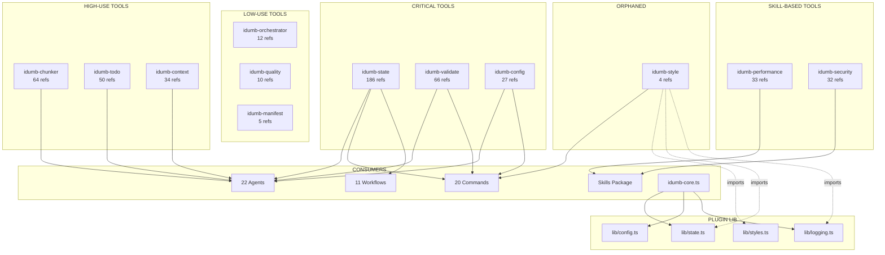

# iDumb Tools Dependency Graph

**Generated:** 2026-02-05  
**Phase:** tools-restructure-planning  
**Integration Check by:** @idumb-integration-checker

---

## Executive Summary

| Category | Count | Notes |
|----------|-------|-------|
| Total Tools | 12 | In `src/tools/*.ts` |
| Core Tools (critical) | 3 | state, config, validate |
| Well-Connected Tools | 4 | context, todo, chunker, manifest |
| Specialist Tools | 3 | orchestrator, performance, security, quality |
| Orphaned Tools | 2 | style (1 command), quality (0 commands/workflows) |

---

## 1. Tool -> Consumer Dependency Matrix

### Reference Count by Consumer Type

| Tool | Agents | Commands | Workflows | Skills | **TOTAL** | Status |
|------|--------|----------|-----------|--------|-----------|--------|
| **idumb-state** | 22 | 16 | 7 | 20 | **186** | CRITICAL |
| **idumb-chunker** | 16 | 1 | 0 | 0 | **64** | HIGH |
| **idumb-todo** | 20 | 1 | 1 | 1 | **50** | HIGH |
| **idumb-validate** | 12 | 6 | 1 | 19 | **66** | CRITICAL |
| **idumb-context** | 18 | 4 | 1 | 4 | **34** | MEDIUM |
| **idumb-config** | 3 | 6 | 1 | 4 | **27** | CORE |
| **idumb-performance** | 3 | 0 | 0 | 23 | **33** | SKILL-ONLY |
| **idumb-security** | 3 | 0 | 0 | 24 | **32** | SKILL-ONLY |
| **idumb-orchestrator** | 3 | 0 | 0 | 1 | **12** | LOW |
| **idumb-quality** | 3 | 0 | 0 | 0 | **10** | LOW |
| **idumb-manifest** | 4 | 1 | 0 | 0 | **5** | LOW |
| **idumb-style** | 0 | 1 | 0 | 0 | **4** | ORPHANED |

### Detailed Consumer Lists

#### idumb-state (CRITICAL - 22 agents, 16 commands, 7 workflows)

**Agents:**
- idumb-builder, idumb-codebase-mapper, idumb-debugger, idumb-high-governance
- idumb-integration-checker, idumb-low-validator, idumb-meta-builder, idumb-meta-validator
- idumb-mid-coordinator, idumb-phase-researcher, idumb-plan-checker, idumb-planner
- idumb-project-coordinator, idumb-project-executor, idumb-project-explorer, idumb-project-researcher
- idumb-project-validator, idumb-research-synthesizer, idumb-roadmapper, idumb-skeptic-validator
- idumb-supreme-coordinator, idumb-verifier

**Commands:**
- certify, debug, discuss-phase, execute-phase, health-check, help
- init, map-codebase, new-project, plan-phase, research, resume
- roadmap, status, stress-test, validate

**Workflows:**
- continuous-validation, discuss-phase, execute-phase, plan-phase
- research, roadmap, verify-phase

---

#### idumb-config (CORE - 3 agents, 6 commands, 1 workflow)

**Agents:**
- idumb-high-governance, idumb-mid-coordinator, idumb-supreme-coordinator

**Commands:**
- config, discuss-phase, help, new-project, resume, roadmap

**Workflows:**
- plan-phase

---

#### idumb-validate (CRITICAL - 12 agents, 6 commands, 1 workflow)

**Agents:**
- idumb-builder, idumb-debugger, idumb-high-governance, idumb-integration-checker
- idumb-low-validator, idumb-meta-builder, idumb-meta-validator, idumb-mid-coordinator
- idumb-plan-checker, idumb-skeptic-validator, idumb-supreme-coordinator, idumb-verifier

**Commands:**
- help, research, resume, roadmap, status, validate

**Workflows:**
- verify-phase

---

#### idumb-context (MEDIUM - 18 agents, 4 commands, 1 workflow)

**Agents:**
- idumb-codebase-mapper, idumb-debugger, idumb-high-governance, idumb-integration-checker
- idumb-low-validator, idumb-meta-validator, idumb-mid-coordinator, idumb-phase-researcher
- idumb-plan-checker, idumb-planner, idumb-project-executor, idumb-project-explorer
- idumb-project-researcher, idumb-research-synthesizer, idumb-roadmapper, idumb-skeptic-validator
- idumb-supreme-coordinator, idumb-verifier

**Commands:**
- debug, help, research, roadmap

**Workflows:**
- verify-phase

---

#### idumb-manifest (LOW - 4 agents, 1 command, 0 workflows)

**Agents:**
- idumb-high-governance, idumb-integration-checker, idumb-mid-coordinator, idumb-supreme-coordinator

**Commands:**
- help

**Workflows:** (none)

---

#### idumb-todo (HIGH - 20 agents, 1 command, 1 workflow)

**Agents:**
- idumb-builder, idumb-codebase-mapper, idumb-debugger, idumb-high-governance
- idumb-integration-checker, idumb-meta-builder, idumb-meta-validator, idumb-mid-coordinator
- idumb-phase-researcher, idumb-plan-checker, idumb-planner, idumb-project-coordinator
- idumb-project-executor, idumb-project-explorer, idumb-project-researcher, idumb-research-synthesizer
- idumb-roadmapper, idumb-skeptic-validator, idumb-supreme-coordinator, idumb-verifier

**Commands:**
- help

**Workflows:**
- execute-phase

---

#### idumb-chunker (HIGH - 16 agents, 1 command, 0 workflows)

**Agents:**
- idumb-builder, idumb-codebase-mapper, idumb-high-governance, idumb-low-validator
- idumb-meta-builder, idumb-meta-validator, idumb-phase-researcher, idumb-plan-checker
- idumb-planner, idumb-project-explorer, idumb-project-researcher, idumb-research-synthesizer
- idumb-roadmapper, idumb-skeptic-validator, idumb-supreme-coordinator, idumb-verifier

**Commands:**
- help

**Workflows:** (none)

---

#### idumb-orchestrator (LOW - 3 agents, 0 commands, 0 workflows)

**Agents:**
- idumb-builder, idumb-meta-builder, idumb-meta-validator

**Commands:** (none)

**Workflows:** (none)

---

#### idumb-performance (SKILL-ONLY - 3 agents, 0 commands, 0 workflows)

**Agents:**
- idumb-builder, idumb-meta-builder, idumb-meta-validator

**Commands:** (none)

**Workflows:** (none)

**Note:** Referenced extensively in `src/skills/idumb-performance/SKILL.md` (23+ refs)

---

#### idumb-security (SKILL-ONLY - 3 agents, 0 commands, 0 workflows)

**Agents:**
- idumb-builder, idumb-meta-builder, idumb-meta-validator

**Commands:** (none)

**Workflows:** (none)

**Note:** Referenced extensively in `src/skills/idumb-security/SKILL.md` (24+ refs)

---

#### idumb-quality (LOW - 3 agents, 0 commands, 0 workflows)

**Agents:**
- idumb-builder, idumb-meta-builder, idumb-meta-validator

**Commands:** (none)

**Workflows:** (none)

---

#### idumb-style (ORPHANED - 0 agents, 1 command, 0 workflows)

**Agents:** (none)

**Commands:**
- style

**Workflows:** (none)

---

## 2. Tool -> Plugin Dependencies

### Plugin Core (`src/plugins/idumb-core.ts`)

The plugin imports from `src/plugins/lib/index.ts` which re-exports all lib modules.

**lib modules used by plugin:**
- `lib/types.ts` - Core type definitions
- `lib/logging.ts` - File-based logging (TUI-safe)
- `lib/state.ts` - State management (read/write/anchors/history)
- `lib/config.ts` - Configuration management
- `lib/checkpoint.ts` - Checkpoint create/load/list
- `lib/execution-metrics.ts` - Stall detection, limits
- `lib/chain-rules.ts` - Chain enforcement rules
- `lib/session-tracker.ts` - Session tracking
- `lib/governance-builder.ts` - Governance prefix building
- `lib/schema-validator.ts` - JSON schema validation
- `lib/styles.ts` - Style management

### Tools -> Plugin Lib Dependencies

| Tool | Uses Plugin Lib? | Modules Used |
|------|------------------|--------------|
| idumb-style | YES | lib/styles, lib/state, lib/logging |
| idumb-state | NO | (standalone) |
| idumb-config | NO | (standalone) |
| idumb-validate | NO | (standalone) |
| idumb-context | NO | (standalone) |
| idumb-manifest | NO | (standalone) |
| idumb-todo | NO | (standalone) |
| idumb-chunker | NO | Uses tools/lib/* |
| idumb-orchestrator | NO | (standalone) |
| idumb-performance | NO | (standalone) |
| idumb-security | NO | (standalone) |
| idumb-quality | NO | (standalone) |

---

## 3. Inter-Tool Dependencies

### Tool Lib Modules (`src/tools/lib/*.ts`)

**hierarchy-parsers.ts** imports from:
- `fs` (Node built-in)
- `./index-manager` (HierarchyNode type, generateHierarchyId)

**index-manager.ts** imports from:
- `fs`, `path` (Node built-ins)
- No internal dependencies

**bash-executors.ts** imports from:
- `child_process`, `fs` (Node built-ins)
- No internal dependencies

### Tools Using Tool Lib

| Tool | Uses tools/lib? | Modules Used |
|------|-----------------|--------------|
| idumb-chunker | YES | hierarchy-parsers, index-manager, bash-executors |
| All others | NO | - |

### Plugin Lib Dependencies (Internal)

```
lib/types.ts (base - no deps)
    ^
    |
lib/logging.ts (base - no deps)
    ^
    |
lib/state.ts
    ^ imports: types
    |
lib/config.ts
    ^ imports: types, logging, state
    |
lib/checkpoint.ts
    ^ imports: types, logging, state
    |
lib/execution-metrics.ts
    ^ imports: types, logging, state
    |
lib/chain-rules.ts
    ^ imports: types, state
    |
lib/session-tracker.ts
    ^ imports: state
    |
lib/governance-builder.ts
    ^ imports: types, state
    |
lib/styles.ts
    ^ imports: logging
    |
lib/schema-validator.ts (standalone)
```

---

## 4. Dependency Flow Diagram



---

## 5. Critical Path Analysis

### Tools That Would Break Everything If Removed

| Tool | Dependent Count | Impact Level | Notes |
|------|-----------------|--------------|-------|
| **idumb-state** | 22 agents, 16 commands, 7 workflows | **CATASTROPHIC** | Core governance state - ALL agents depend on it |
| **idumb-validate** | 12 agents, 6 commands, 1 workflow | **SEVERE** | Validation infrastructure - verification broken |
| **idumb-config** | 3 agents, 6 commands, 1 workflow | **HIGH** | Configuration - init/setup broken |
| **idumb-chunker** | 16 agents | **MODERATE** | Large file handling - research impaired |
| **idumb-todo** | 20 agents | **MODERATE** | Task tracking - execution tracking impaired |

### Orphaned/Low-Use Tools (Removal Candidates)

| Tool | Dependents | Recommendation |
|------|------------|----------------|
| **idumb-style** | 1 command only | CANDIDATE FOR REMOVAL - Not used by any agent |
| **idumb-quality** | 3 meta agents only | MERGE with validate or security |
| **idumb-manifest** | 4 coordinators, 1 cmd | LOW PRIORITY - keep but don't expand |
| **idumb-orchestrator** | 3 meta agents only | MERGE with state or plugin |

### Skill-Only Tools (Disconnected from Core Flow)

| Tool | Issue | Recommendation |
|------|-------|----------------|
| **idumb-performance** | 0 commands, 0 workflows | Need command integration OR merge into validate |
| **idumb-security** | 0 commands, 0 workflows | Need command integration OR merge into validate |

---

## 6. Orphaned Components Detail

### idumb-style (ORPHANED)
- **Agents referencing:** 0
- **Commands referencing:** 1 (style.md)
- **Workflows referencing:** 0
- **Plugin lib dependency:** Uses lib/styles, lib/state, lib/logging
- **Issue:** Tool exists but no agents use it
- **Evidence:** `grep -r "idumb-style" src/agents/*.md` returns 0 matches

### idumb-quality (SEMI-ORPHANED)
- **Agents referencing:** 3 (builder, meta-builder, meta-validator only)
- **Commands referencing:** 0
- **Workflows referencing:** 0
- **Issue:** Only used by meta/builder agents, no command exposure
- **Evidence:** `grep -r "idumb-quality" src/commands/idumb/*.md` returns 0 matches

### idumb-orchestrator (SEMI-ORPHANED)
- **Agents referencing:** 3 (builder, meta-builder, meta-validator only)
- **Commands referencing:** 0
- **Workflows referencing:** 0
- **Issue:** Pre-write gates exist but not exposed via commands

---

## 7. Integration Gaps Identified

### Gap 1: Skill Tools Without Command Exposure

| Tool | Skill References | Command Exposure | Gap |
|------|------------------|------------------|-----|
| idumb-performance | 23+ in skills | 0 commands | Commands should invoke skill checks |
| idumb-security | 24+ in skills | 0 commands | Commands should invoke security scans |

### Gap 2: Tool-Agent Misalignment

| Tool | Expected Agents | Missing From |
|------|-----------------|--------------|
| idumb-style | All agents producing output | ALL 22 agents |
| idumb-orchestrator | Coordinators | Only meta-level has it |

### Gap 3: Workflow Integration

| Workflow | Uses state | Uses validate | Uses config | Gap |
|----------|------------|---------------|-------------|-----|
| stress-test | YES | NO | NO | Should use validate |
| transition | NO | NO | NO | Needs state integration |

---

## 8. Recommended Actions

### Priority 1: Core Tool Consolidation

1. **Keep as-is:** idumb-state, idumb-validate, idumb-config
2. **Enhance:** Add more sub-commands, standardize interfaces

### Priority 2: Tool Mergers

| Merge From | Merge Into | Rationale |
|------------|------------|-----------|
| idumb-quality | idumb-validate | Both do validation, quality is subset |
| idumb-orchestrator | idumb-state | Orchestration state belongs with state |

### Priority 3: Tool Removals

| Tool | Action | Rationale |
|------|--------|-----------|
| idumb-style | REMOVE or deprecate | 0 agent users, lib dependency makes it complex |

### Priority 4: Integration Fixes

| Tool | Action |
|------|--------|
| idumb-performance | Add /idumb:performance command |
| idumb-security | Add /idumb:security command |

---

## Appendix: Raw Evidence

### Reference Counts (grep results)

```
idumb-state:     agents=106 commands=36 workflows=24 skills=20
idumb-config:    agents=11  commands=11 workflows=1  skills=4
idumb-validate:  agents=36  commands=10 workflows=1  skills=19
idumb-context:   agents=25  commands=4  workflows=1  skills=4
idumb-manifest:  agents=4   commands=1  workflows=0  skills=0
idumb-todo:      agents=47  commands=1  workflows=1  skills=1
idumb-chunker:   agents=63  commands=1  workflows=0  skills=0
idumb-orchestrator: agents=11 commands=0 workflows=0 skills=1
idumb-performance:  agents=10 commands=0 workflows=0 skills=23
idumb-security:     agents=8  commands=0 workflows=0 skills=24
idumb-quality:      agents=10 commands=0 workflows=0 skills=0
idumb-style:        agents=0  commands=4 workflows=0 skills=0
```

### File Locations Verified

```
src/tools/idumb-state.ts      (standalone)
src/tools/idumb-config.ts     (standalone)
src/tools/idumb-validate.ts   (standalone)
src/tools/idumb-context.ts    (standalone)
src/tools/idumb-manifest.ts   (standalone)
src/tools/idumb-todo.ts       (standalone)
src/tools/idumb-chunker.ts    (uses tools/lib/*)
src/tools/idumb-orchestrator.ts (standalone)
src/tools/idumb-performance.ts  (standalone)
src/tools/idumb-security.ts     (standalone)
src/tools/idumb-quality.ts      (standalone)
src/tools/idumb-style.ts        (uses plugins/lib/*)
```

---

*Document generated by @idumb-integration-checker as part of tools-restructure-planning phase*
