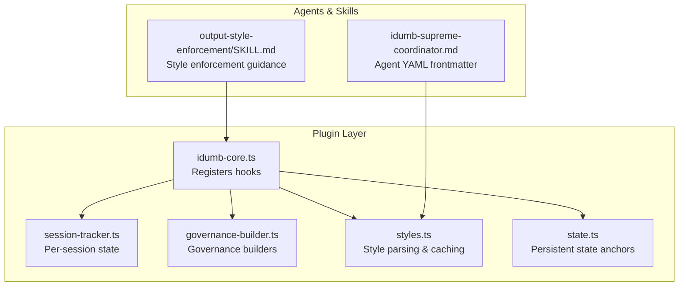
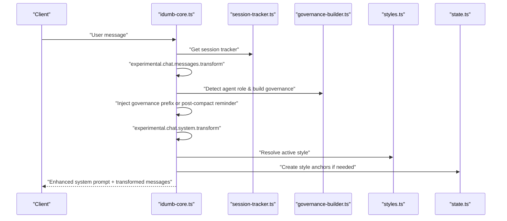
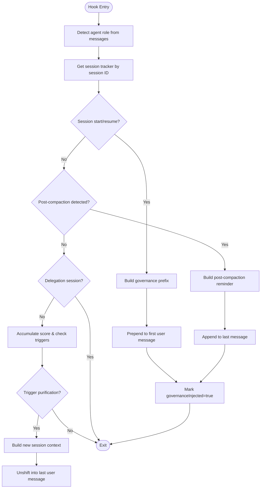
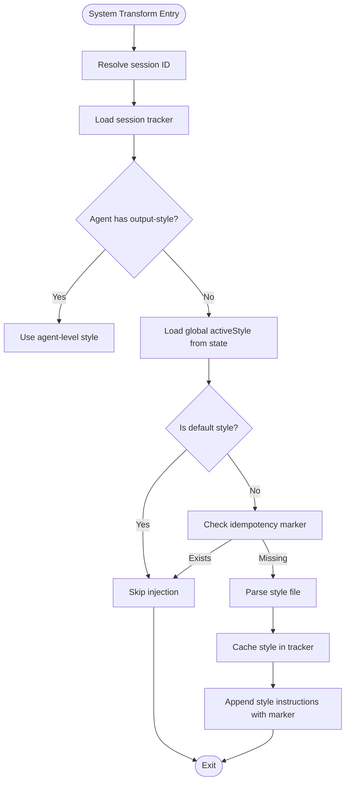
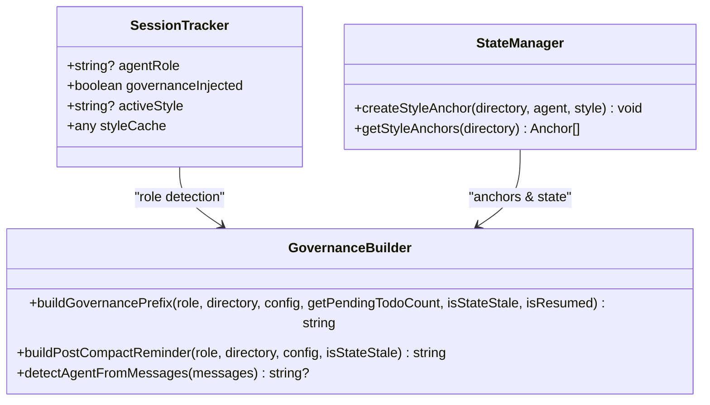
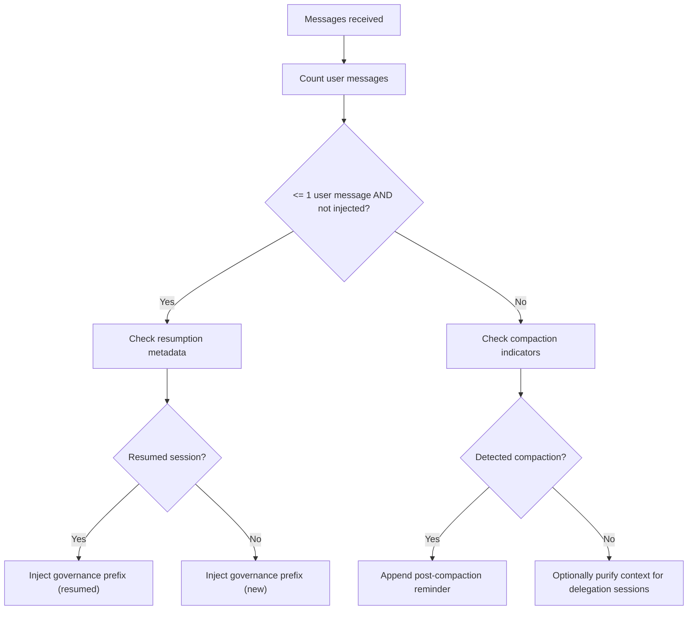
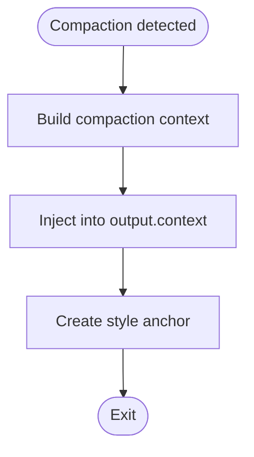
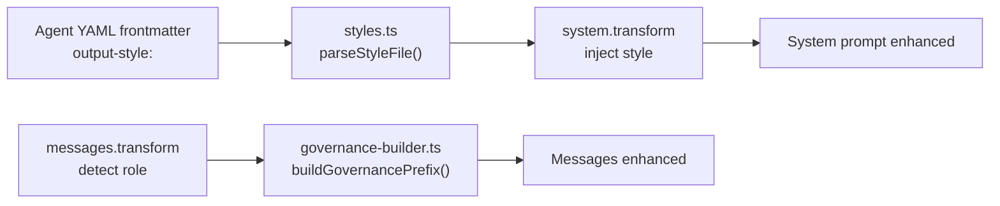
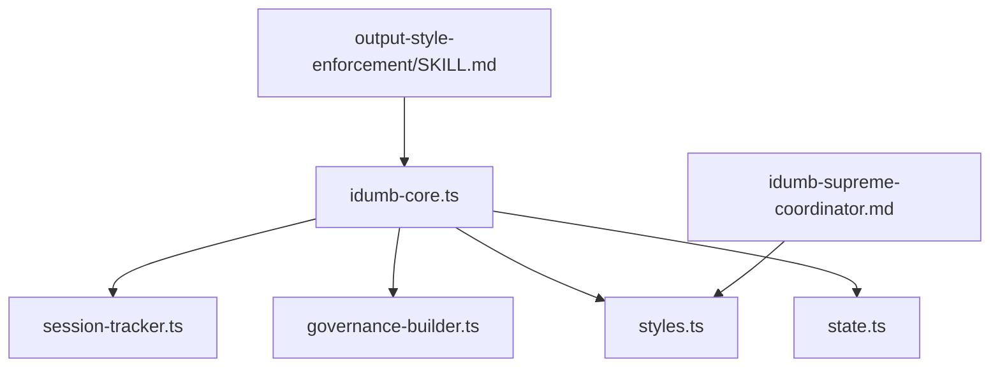
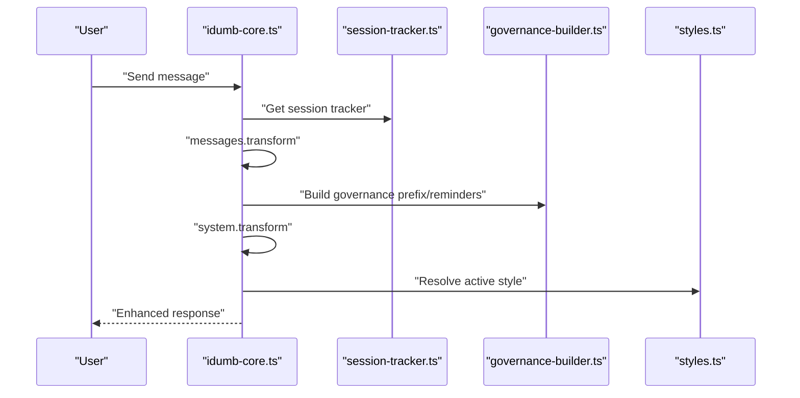

# Message Transform Hooks

<cite>
**Referenced Files in This Document**
- [idumb-core.ts](file://src/plugins/idumb-core.ts)
- [session-tracker.ts](file://src/plugins/lib/session-tracker.ts)
- [governance-builder.ts](file://src/plugins/lib/governance-builder.ts)
- [styles.ts](file://src/plugins/lib/styles.ts)
- [state.ts](file://src/plugins/lib/state.ts)
- [IMPLEMENTATION-GUIDE.md](file://docs/IMPLEMENTATION-GUIDE.md)
- [NEW-SESSION-VALIDATION.md](file://.plugin-dev/research/NEW-SESSION-VALIDATION.md)
- [MESSAGE-INTERCEPTION-SPEC.md](file://.plugin-dev/research/MESSAGE-INTERCEPTION-SPEC.md)
- [SESSION-STATES-RESEARCH-2026-02-04.md](file://.plugin-dev/research/SESSION-STATES-RESEARCH-2026-02-04.md)
- [checkpoint.ts](file://src/plugins/lib/checkpoint.ts)
- [idumb-supreme-coordinator.md](file://src/agents/idumb-supreme-coordinator.md)
- [output-style-enforcement/SKILL.md](file://src/skills/output-style-enforcement/SKILL.md)
</cite>

## Table of Contents
1. [Introduction](#introduction)
2. [Project Structure](#project-structure)
3. [Core Components](#core-components)
4. [Architecture Overview](#architecture-overview)
5. [Detailed Component Analysis](#detailed-component-analysis)
6. [Dependency Analysis](#dependency-analysis)
7. [Performance Considerations](#performance-considerations)
8. [Troubleshooting Guide](#troubleshooting-guide)
9. [Conclusion](#conclusion)
10. [Appendices](#appendices)

## Introduction
This document explains iDumb’s message transformation hooks with a focus on two experimental hooks:
- experimental.chat.messages.transform: injects governance and context-aware reminders into chat messages
- experimental.chat.system.transform: injects output style instructions into the system prompt

It covers the governance injection mechanism, session start detection, post-compaction recovery patterns, message transformation pipeline, system prompt modification, and output style injection. Practical examples demonstrate implementing custom message transformers, handling session resumption, and managing context preservation across compaction events. It also documents the relationship between message transforms and agent role detection, including how different agent types receive tailored governance instructions.

## Project Structure
The message transformation system spans several modules:
- Plugin core registers and orchestrates hooks
- Session tracker maintains per-session state
- Governance builder constructs role-specific governance content
- Styles library manages output style definitions and injection
- State manager persists anchors and active style
- Agent files define role-specific output styles
- Skills provide enforcement and remediation guidance

**Diagram sources**
- [idumb-core.ts](file://src/plugins/idumb-core.ts#L384-L445)
- [session-tracker.ts](file://src/plugins/lib/session-tracker.ts#L94-L117)
- [governance-builder.ts](file://src/plugins/lib/governance-builder.ts#L200-L346)
- [styles.ts](file://src/plugins/lib/styles.ts#L145-L165)
- [state.ts](file://src/plugins/lib/state.ts#L111-L149)
- [idumb-supreme-coordinator.md](file://src/agents/idumb-supreme-coordinator.md#L63-L72)
- [output-style-enforcement/SKILL.md](file://src/skills/output-style-enforcement/SKILL.md#L1-L71)

**Section sources**
- [idumb-core.ts](file://src/plugins/idumb-core.ts#L384-L445)
- [session-tracker.ts](file://src/plugins/lib/session-tracker.ts#L94-L117)
- [governance-builder.ts](file://src/plugins/lib/governance-builder.ts#L200-L346)
- [styles.ts](file://src/plugins/lib/styles.ts#L145-L165)
- [state.ts](file://src/plugins/lib/state.ts#L111-L149)
- [idumb-supreme-coordinator.md](file://src/agents/idumb-supreme-coordinator.md#L63-L72)
- [output-style-enforcement/SKILL.md](file://src/skills/output-style-enforcement/SKILL.md#L1-L71)

## Core Components
- experimental.chat.messages.transform: Detects session start and compaction, injects governance prefixes and post-compaction reminders, and optionally purifies context for delegation sessions.
- experimental.chat.system.transform: Injects output style instructions into the system prompt, with idempotent markers and agent-level overrides.
- Session tracker: Maintains agent role, governance injection state, and per-session caches.
- Governance builder: Provides role-specific governance content and post-compaction reminders.
- Styles library: Parses style definitions, caches content, and resolves active style.
- State anchors: Persist critical context across compaction and resumption.

**Section sources**
- [idumb-core.ts](file://src/plugins/idumb-core.ts#L384-L445)
- [session-tracker.ts](file://src/plugins/lib/session-tracker.ts#L94-L117)
- [governance-builder.ts](file://src/plugins/lib/governance-builder.ts#L200-L346)
- [styles.ts](file://src/plugins/lib/styles.ts#L145-L165)
- [state.ts](file://src/plugins/lib/state.ts#L111-L149)

## Architecture Overview
The message transformation pipeline integrates with OpenCode’s hook system. The sequence below shows how hooks interact with session state and governance:

**Diagram sources**
- [idumb-core.ts](file://src/plugins/idumb-core.ts#L384-L445)
- [session-tracker.ts](file://src/plugins/lib/session-tracker.ts#L94-L117)
- [governance-builder.ts](file://src/plugins/lib/governance-builder.ts#L200-L346)
- [styles.ts](file://src/plugins/lib/styles.ts#L145-L165)
- [state.ts](file://src/plugins/lib/state.ts#L111-L149)

## Detailed Component Analysis

### Message Transform Hook: experimental.chat.messages.transform
Purpose:
- Detect session start and resumption
- Detect post-compaction contexts
- Inject governance prefixes and post-compaction reminders
- Optionally purify context for delegation sessions

Key behaviors:
- Agent role detection from messages
- Session ID extraction and tracker access
- Session start detection via user message count and governance flag
- Post-compaction detection via keywords and message count
- Injection strategies:
  - Prepend governance prefix to the first user message
  - Append post-compaction reminder to the last message
  - Optionally prepend purified context for delegation sessions

**Diagram sources**
- [idumb-core.ts](file://src/plugins/idumb-core.ts#L557-L618)
- [session-tracker.ts](file://src/plugins/lib/session-tracker.ts#L94-L117)
- [governance-builder.ts](file://src/plugins/lib/governance-builder.ts#L200-L346)
- [NEW-SESSION-VALIDATION.md](file://.plugin-dev/research/NEW-SESSION-VALIDATION.md#L619-L670)

**Section sources**
- [idumb-core.ts](file://src/plugins/idumb-core.ts#L557-L618)
- [session-tracker.ts](file://src/plugins/lib/session-tracker.ts#L94-L117)
- [governance-builder.ts](file://src/plugins/lib/governance-builder.ts#L200-L346)
- [NEW-SESSION-VALIDATION.md](file://.plugin-dev/research/NEW-SESSION-VALIDATION.md#L619-L670)

### System Transform Hook: experimental.chat.system.transform
Purpose:
- Inject output style instructions into the system prompt
- Respect idempotency and agent-level overrides
- Cache style content per session

Resolution order:
- Agent-level style from YAML frontmatter (if present)
- Global activeStyle from state.json (if not default)
- Default behavior (no extra instructions)

**Diagram sources**
- [idumb-core.ts](file://src/plugins/idumb-core.ts#L384-L445)
- [styles.ts](file://src/plugins/lib/styles.ts#L145-L165)
- [state.ts](file://src/plugins/lib/state.ts#L111-L149)

**Section sources**
- [idumb-core.ts](file://src/plugins/idumb-core.ts#L384-L445)
- [styles.ts](file://src/plugins/lib/styles.ts#L145-L165)
- [state.ts](file://src/plugins/lib/state.ts#L111-L149)

### Governance Injection Mechanism
- Role detection: Scans messages for agent identifiers to infer role.
- Prefix building: Constructs role-specific governance content including language enforcement, first-action requirements, and phase context.
- Reminder building: Creates post-compaction reminders that include language enforcement, recent history, critical anchors, and recommended next steps.

**Diagram sources**
- [session-tracker.ts](file://src/plugins/lib/session-tracker.ts#L94-L117)
- [governance-builder.ts](file://src/plugins/lib/governance-builder.ts#L200-L346)
- [state.ts](file://src/plugins/lib/state.ts#L111-L149)

**Section sources**
- [session-tracker.ts](file://src/plugins/lib/session-tracker.ts#L94-L117)
- [governance-builder.ts](file://src/plugins/lib/governance-builder.ts#L200-L346)
- [state.ts](file://src/plugins/lib/state.ts#L111-L149)

### Session Start Detection and Resumption
- Session start: Determined by user message count and governance flag; optionally augmented by resumption detection.
- Resumption: Detected by session metadata indicating recent idle periods.
- Context purification: For non-delegation sessions, accumulated score and manual triggers can prompt context purification.

**Diagram sources**
- [session-tracker.ts](file://src/plugins/lib/session-tracker.ts#L269-L280)
- [governance-builder.ts](file://src/plugins/lib/governance-builder.ts#L200-L346)
- [NEW-SESSION-VALIDATION.md](file://.plugin-dev/research/NEW-SESSION-VALIDATION.md#L619-L670)

**Section sources**
- [session-tracker.ts](file://src/plugins/lib/session-tracker.ts#L269-L280)
- [governance-builder.ts](file://src/plugins/lib/governance-builder.ts#L200-L346)
- [NEW-SESSION-VALIDATION.md](file://.plugin-dev/research/NEW-SESSION-VALIDATION.md#L619-L670)

### Post-Compaction Recovery Patterns
- Detection: Keywords, context-loss indicators, and message count thresholds.
- Recovery: Injects reminders that preserve language enforcement, recent history, critical anchors, and recommended next steps.
- Anchors: Style anchors are created to persist style across compaction.

**Diagram sources**
- [idumb-core.ts](file://src/plugins/idumb-core.ts#L352-L370)
- [state.ts](file://src/plugins/lib/state.ts#L111-L149)

**Section sources**
- [idumb-core.ts](file://src/plugins/idumb-core.ts#L352-L370)
- [state.ts](file://src/plugins/lib/state.ts#L111-L149)

### Relationship Between Message Transforms and Agent Role Detection
- Agent role detection occurs in both hooks to tailor governance and reminders.
- Agent YAML frontmatter defines expected output styles; system transform can use agent-level overrides.
- Enforcement skill provides remediation guidance when output deviates from expected style.

**Diagram sources**
- [idumb-supreme-coordinator.md](file://src/agents/idumb-supreme-coordinator.md#L63-L72)
- [styles.ts](file://src/plugins/lib/styles.ts#L50-L91)
- [idumb-core.ts](file://src/plugins/idumb-core.ts#L384-L445)
- [governance-builder.ts](file://src/plugins/lib/governance-builder.ts#L200-L346)

**Section sources**
- [idumb-supreme-coordinator.md](file://src/agents/idumb-supreme-coordinator.md#L63-L72)
- [styles.ts](file://src/plugins/lib/styles.ts#L50-L91)
- [idumb-core.ts](file://src/plugins/idumb-core.ts#L384-L445)
- [governance-builder.ts](file://src/plugins/lib/governance-builder.ts#L200-L346)

### Practical Examples

- Implementing a custom message transformer:
  - Register experimental.chat.messages.transform in the plugin
  - Detect agent role and session ID
  - Inject governance prefix at session start
  - Append post-compaction reminder when compaction is detected
  - Optionally purify context for delegation sessions

- Handling session resumption:
  - Use session metadata to detect resumption
  - Inject resumption context into the first user message
  - Ensure language enforcement and critical anchors are preserved

- Managing context preservation across compaction:
  - Create style anchors to persist style across compaction
  - Inject compaction context into output.context
  - Rebuild reminders with recent history and critical anchors

**Section sources**
- [IMPLEMENTATION-GUIDE.md](file://docs/IMPLEMENTATION-GUIDE.md#L104-L335)
- [session-tracker.ts](file://src/plugins/lib/session-tracker.ts#L269-L280)
- [state.ts](file://src/plugins/lib/state.ts#L111-L149)
- [idumb-core.ts](file://src/plugins/idumb-core.ts#L352-L370)

## Dependency Analysis
The hooks depend on:
- Session tracker for per-session state and caching
- Governance builder for role-specific content
- Styles library for style parsing and caching
- State manager for anchors and active style
- Agent YAML frontmatter for agent-level style configuration
- Skills for enforcement guidance

**Diagram sources**
- [idumb-core.ts](file://src/plugins/idumb-core.ts#L384-L445)
- [session-tracker.ts](file://src/plugins/lib/session-tracker.ts#L94-L117)
- [governance-builder.ts](file://src/plugins/lib/governance-builder.ts#L200-L346)
- [styles.ts](file://src/plugins/lib/styles.ts#L145-L165)
- [state.ts](file://src/plugins/lib/state.ts#L111-L149)
- [idumb-supreme-coordinator.md](file://src/agents/idumb-supreme-coordinator.md#L63-L72)
- [output-style-enforcement/SKILL.md](file://src/skills/output-style-enforcement/SKILL.md#L1-L71)

**Section sources**
- [idumb-core.ts](file://src/plugins/idumb-core.ts#L384-L445)
- [session-tracker.ts](file://src/plugins/lib/session-tracker.ts#L94-L117)
- [governance-builder.ts](file://src/plugins/lib/governance-builder.ts#L200-L346)
- [styles.ts](file://src/plugins/lib/styles.ts#L145-L165)
- [state.ts](file://src/plugins/lib/state.ts#L111-L149)
- [idumb-supreme-coordinator.md](file://src/agents/idumb-supreme-coordinator.md#L63-L72)
- [output-style-enforcement/SKILL.md](file://src/skills/output-style-enforcement/SKILL.md#L1-L71)

## Performance Considerations
- Minimize repeated parsing: Cache style content in the session tracker.
- Avoid excessive injections: Use idempotency markers to prevent redundant system prompt modifications.
- Keep injection sizes reasonable: Prepend governance prefixes and append reminders carefully to avoid exceeding token limits.
- Use efficient detection: Keywords and message count thresholds reduce overhead.

[No sources needed since this section provides general guidance]

## Troubleshooting Guide
Common issues and resolutions:
- Governance not injected:
  - Verify agent role detection and session ID extraction
  - Confirm session start conditions and governance flag
- Post-compaction reminder missing:
  - Check compaction detection logic and message indicators
  - Ensure language enforcement and critical anchors are present
- Style instructions not applied:
  - Confirm activeStyle resolution order and idempotency markers
  - Validate agent-level output-style configuration
- Session resumption context incorrect:
  - Verify session metadata and resumption detection logic
  - Ensure resumption context is prepended to the first user message

**Section sources**
- [idumb-core.ts](file://src/plugins/idumb-core.ts#L384-L445)
- [session-tracker.ts](file://src/plugins/lib/session-tracker.ts#L269-L280)
- [governance-builder.ts](file://src/plugins/lib/governance-builder.ts#L200-L346)
- [styles.ts](file://src/plugins/lib/styles.ts#L145-L165)
- [state.ts](file://src/plugins/lib/state.ts#L111-L149)

## Conclusion
iDumb’s message transformation hooks provide a robust framework for governance injection, session state awareness, and output style enforcement. By combining role detection, session tracking, and context preservation, the system ensures consistent behavior across session starts, resumptions, and compaction events. Agent-level customization and enforcement skills further refine output quality and adherence to expected formats.

[No sources needed since this section summarizes without analyzing specific files]

## Appendices

### Hook Integration Flow

**Diagram sources**
- [idumb-core.ts](file://src/plugins/idumb-core.ts#L384-L445)
- [session-tracker.ts](file://src/plugins/lib/session-tracker.ts#L94-L117)
- [governance-builder.ts](file://src/plugins/lib/governance-builder.ts#L200-L346)
- [styles.ts](file://src/plugins/lib/styles.ts#L145-L165)

### Session States and Context Recovery
- Session states: Beginning, Between-Turn, Executing, Stale, Stopped, Custom
- Context recovery: Detect compaction or new-session indicators and inject reminders with recent history and critical anchors

**Section sources**
- [SESSION-STATES-RESEARCH-2026-02-04.md](file://.plugin-dev/research/SESSION-STATES-RESEARCH-2026-02-04.md#L278-L357)
- [idumb-core.ts](file://src/plugins/idumb-core.ts#L557-L618)