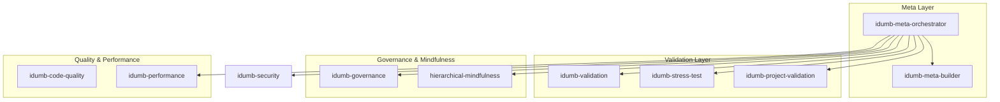
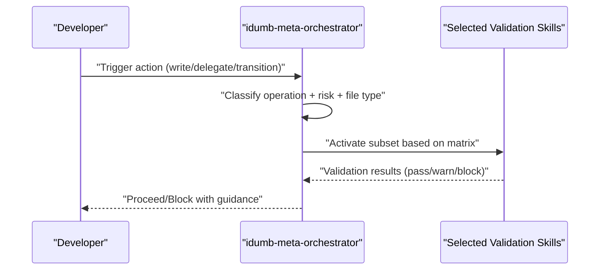
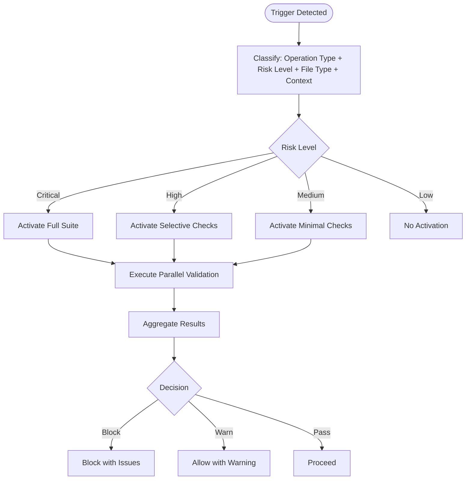
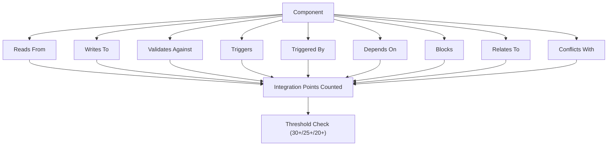
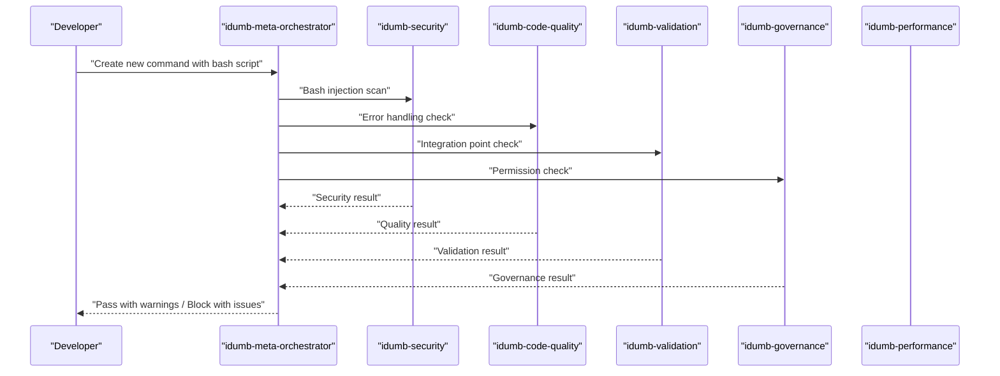
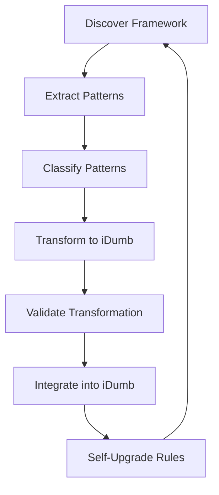
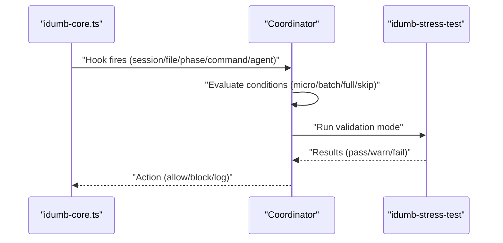
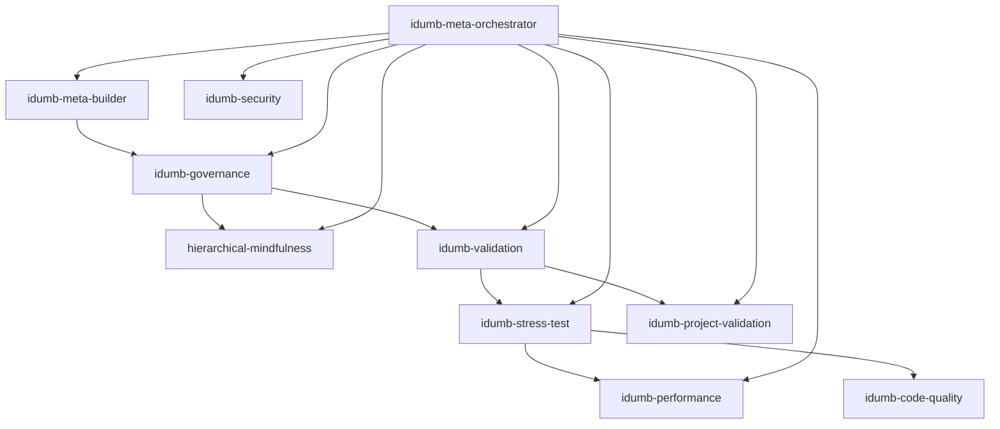

# Skill Architecture Overview

<cite>
**Referenced Files in This Document**
- [SKILL-ARCHITECTURE.md](file://src/skills/SKILL-ARCHITECTURE.md)
- [idumb-meta-orchestrator/SKILL.md](file://src/skills/idumb-meta-orchestrator/SKILL.md)
- [idumb-validation/SKILL.md](file://src/skills/idumb-validation/SKILL.md)
- [idumb-stress-test/SKILL.md](file://src/skills/idumb-stress-test/SKILL.md)
- [idumb-governance/SKILL.md](file://src/skills/idumb-governance/SKILL.md)
- [idumb-code-quality/SKILL.md](file://src/skills/idumb-code-quality/SKILL.md)
- [idumb-performance/SKILL.md](file://src/skills/idumb-performance/SKILL.md)
- [hierarchical-mindfulness/SKILL.md](file://src/skills/hierarchical-mindfulness/SKILL.md)
- [idumb-project-validation/SKILL.md](file://src/skills/idumb-project-validation/SKILL.md)
- [idumb-meta-builder/SKILL.md](file://src/skills/idumb-meta-builder/SKILL.md)
- [integration-checklist.md](file://src/skills/idumb-meta-builder/references/integration-checklist.md)
- [integration-points-reference.md](file://src/skills/idumb-validation/references/integration-points-reference.md)
- [auto-activation-hooks.md](file://src/skills/idumb-stress-test/references/auto-activation-hooks.md)
- [module-schema.md](file://src/skills/idumb-meta-builder/references/module-schema.md)
- [validation-patterns.md](file://src/skills/idumb-meta-builder/references/validation-patterns.md)
</cite>

## Table of Contents
1. [Introduction](#introduction)
2. [Project Structure](#project-structure)
3. [Core Components](#core-components)
4. [Architecture Overview](#architecture-overview)
5. [Detailed Component Analysis](#detailed-component-analysis)
6. [Dependency Analysis](#dependency-analysis)
7. [Performance Considerations](#performance-considerations)
8. [Troubleshooting Guide](#troubleshooting-guide)
9. [Conclusion](#conclusion)
10. [Appendices](#appendices)

## Introduction
This document presents the iDumb skill architecture overview, detailing the foundational principles, the 10 complementary skills, non-overlapping design philosophy, integration thresholds, and activation patterns. It explains how the idumb-meta-orchestrator automatically coordinates validation across skills based on operation type, risk level, file type, and context. It also covers the integration point validation system, minimum point requirements, and practical activation scenarios, concluding with consolidation recommendations and maintenance guidelines.

## Project Structure
The iDumb framework organizes governance, validation, security, performance, and meta capabilities into discrete skills. Each skill defines its purpose, integration points, activation rules, and validation layers. The meta-orchestrator coordinates activation across these skills to ensure context-aware, risk-based validation.



**Diagram sources**
- [idumb-meta-orchestrator/SKILL.md](file://src/skills/idumb-meta-orchestrator/SKILL.md#L36-L51)
- [SKILL-ARCHITECTURE.md](file://src/skills/SKILL-ARCHITECTURE.md#L13-L27)

**Section sources**
- [SKILL-ARCHITECTURE.md](file://src/skills/SKILL-ARCHITECTURE.md#L9-L28)

## Core Components
The iDumb skill system comprises 10 complementary skills organized by domain and purpose:

- idumb-meta-orchestrator (META): Master coordinator that activates other skills based on context, operation type, and risk level.
- idumb-security (SECURITY): Validates security posture (injection, traversal, permissions).
- idumb-code-quality (CODE-QUALITY): Enforces error handling, cross-platform compatibility, and documentation.
- idumb-performance (PERFORMANCE): Optimizes scanning efficiency, enforces iteration limits, and manages cleanup.
- idumb-validation (VALIDATION): Iterative gap detection, integration completeness, and self-healing workflows.
- idumb-governance (GOVERNANCE): Defines agent categories, delegation hierarchy, and state management.
- hierarchical-mindfulness (MINDFULNESS): Maintains chain integrity, delegation depth, and session resumption.
- idumb-project-validation (PROJECT): Validates user projects (greenfield/brownfield) without blocking development.
- idumb-stress-test (META): Validates agent coordination, integration completeness, and regression prevention.
- idumb-meta-builder (META): Ingests external frameworks and transforms them into iDumb-compatible governance patterns.

**Section sources**
- [SKILL-ARCHITECTURE.md](file://src/skills/SKILL-ARCHITECTURE.md#L13-L27)

## Architecture Overview
The idumb-meta-orchestrator serves as the central decision-maker, selecting which validation skills to activate depending on:
- Operation type (write, delegate, transition, cleanup)
- Risk level (Critical, High, Medium, Low)
- File type (.sh, .ts, .md, .json)
- Context (phase boundaries, session state, resource usage)

It maintains an activation matrix that escalates checks from minimal to comprehensive based on risk and operation type.



**Diagram sources**
- [idumb-meta-orchestrator/SKILL.md](file://src/skills/idumb-meta-orchestrator/SKILL.md#L54-L88)
- [idumb-meta-orchestrator/SKILL.md](file://src/skills/idumb-meta-orchestrator/SKILL.md#L94-L147)

**Section sources**
- [idumb-meta-orchestrator/SKILL.md](file://src/skills/idumb-meta-orchestrator/SKILL.md#L54-L88)
- [idumb-meta-orchestrator/SKILL.md](file://src/skills/idumb-meta-orchestrator/SKILL.md#L94-L147)

## Detailed Component Analysis

### Skill Registry and Domain Coverage
The registry table defines each skill’s package, primary domain, and integration threshold. The domain coverage matrix maps skills to their coverage areas, ensuring non-overlapping responsibilities.

```mermaid
table
title Skill Registry
"Skill" "Package" "Primary Domain" "Integration Threshold"
"idumb-meta-orchestrator" "META" "Coordination - activates other skills based on context" "30+"
"idumb-security" "SECURITY" "Security validation (injection, traversal, permissions)" "20+"
"idumb-code-quality" "CODE-QUALITY" "Error handling, cross-platform, documentation" "20+"
"idumb-performance" "PERFORMANCE" "Efficiency, cleanup, iteration limits" "15+"
"idumb-validation" "VALIDATION" "Integration points, gap detection, completeness" "25+"
"idumb-governance" "GOVERNANCE" "Hierarchy, delegation, state management" "25+"
"hierarchical-mindfulness" "MINDFULNESS" "Chain integrity, delegation depth" "20+"
"idumb-project-validation" "PROJECT" "Greenfield/brownfield, health checks" "20+"
"idumb-stress-test" "META" "Agent coordination, regression sweeps" "25+"
"idumb-meta-builder" "META" "Framework ingestion, transformation" "30+"
```

**Diagram sources**
- [SKILL-ARCHITECTURE.md](file://src/skills/SKILL-ARCHITECTURE.md#L15-L27)

```mermaid
table
title Domain Coverage Matrix
"Domain" "Skills" "Coverage"
"Security" "idumb-security, idumb-governance" "Bash injection, path traversal, permissions, secrets"
"Code Quality" "idumb-code-quality" "Error handling, cross-platform, documentation, standards"
"Performance" "idumb-performance" "Efficient scanning, cleanup policies, iteration limits"
"Integration" "idumb-validation, idumb-stress-test" "Integration points, gap detection, regression"
"Governance" "idumb-governance, hierarchical-mindfulness" "Hierarchy, delegation, chain integrity, state"
"Project" "idumb-project-validation" "Greenfield/brownfield, health monitoring"
"Coordination" "idumb-meta-orchestrator" "Context-aware skill activation"
"Meta" "idumb-meta-builder" "Framework ingestion and transformation"
```

**Diagram sources**
- [SKILL-ARCHITECTURE.md](file://src/skills/SKILL-ARCHITECTURE.md#L30-L42)

**Section sources**
- [SKILL-ARCHITECTURE.md](file://src/skills/SKILL-ARCHITECTURE.md#L13-L42)

### Non-Overlapping Design Philosophy
The architecture resolves potential overlaps by assigning distinct purposes:
- idumb-validation focuses on framework-level structure and integration completeness.
- idumb-stress-test focuses on runtime behavior and coordination.
- idumb-governance defines framework structure and permission matrices.
- hierarchical-mindfulness tracks session state and chain integrity during execution.

```mermaid
flowchart TD
A["idumb-validation"] --> A1["Structure and integration completeness"]
A --> A2["Component has required integration points"]
A --> A3["Frontmatter schema is valid"]
A --> A4["Required fields present"]
B["idumb-stress-test"] --> B1["Runtime behavior and coordination"]
B --> B2["Agents spawn correctly"]
B --> B3["Delegation chains complete"]
B --> B4["No regressions introduced"]
C["idumb-governance"] --> C1["Governance system architecture"]
C --> C2["Agent category definitions"]
C --> C3["Permission matrix rules"]
C --> C4["State schema validation"]
D["hierarchical-mindfulness"] --> D1["Runtime delegation mindfulness"]
D --> D2["Delegation depth tracking"]
D --> D3["Session resumption protocols"]
D --> D4["Chain violation detection"]
```



**Diagram sources**
- [SKILL-ARCHITECTURE.md](file://src/skills/SKILL-ARCHITECTURE.md#L47-L96)

**Section sources**
- [SKILL-ARCHITECTURE.md](file://src/skills/SKILL-ARCHITECTURE.md#L45-L96)

### Activation Patterns and Matrix
The idumb-meta-orchestrator defines activation matrices by operation type, risk level, and file type. Higher risk operations trigger broader validation sets.



**Diagram sources**
- [idumb-meta-orchestrator/SKILL.md](file://src/skills/idumb-meta-orchestrator/SKILL.md#L56-L88)
- [idumb-meta-orchestrator/SKILL.md](file://src/skills/idumb-meta-orchestrator/SKILL.md#L94-L147)

**Section sources**
- [idumb-meta-orchestrator/SKILL.md](file://src/skills/idumb-meta-orchestrator/SKILL.md#L54-L88)
- [idumb-meta-orchestrator/SKILL.md](file://src/skills/idumb-meta-orchestrator/SKILL.md#L94-L147)

### Integration Point Validation System
Each skill must meet minimum integration point thresholds:
- META agents: 30+ points (tools, commands, workflows, state files, other skills)
- Validation skills: 20+ points (read sources, write targets, validation rules, triggers)
- Package skills: 20+ points (package components, integration points, triggers)

The idumb-meta-orchestrator integrates with state, skill registries, and agent definitions, writing governance reports and validation queues.



**Diagram sources**
- [SKILL-ARCHITECTURE.md](file://src/skills/SKILL-ARCHITECTURE.md#L147-L187)
- [integration-points-reference.md](file://src/skills/idumb-validation/references/integration-points-reference.md#L186-L247)

**Section sources**
- [SKILL-ARCHITECTURE.md](file://src/skills/SKILL-ARCHITECTURE.md#L147-L187)
- [integration-checklist.md](file://src/skills/idumb-meta-builder/references/integration-checklist.md#L1-L315)
- [integration-points-reference.md](file://src/skills/idumb-validation/references/integration-points-reference.md#L186-L247)

### Practical Activation Scenarios
Common activation scenarios include:
- Pre-write validation: Security, code quality, validation, governance checks before file writes.
- Phase transition: Full integration scan, stress test, performance check at phase boundaries.
- Continuous monitoring: Periodic resource usage, governance state consistency, drift detection.



**Diagram sources**
- [SKILL-ARCHITECTURE.md](file://src/skills/SKILL-ARCHITECTURE.md#L191-L229)

**Section sources**
- [SKILL-ARCHITECTURE.md](file://src/skills/SKILL-ARCHITECTURE.md#L191-L229)

### Meta-Builder and Framework Ingestion
The idumb-meta-builder ingests external frameworks, classifies patterns, transforms them into iDumb equivalents, validates the transformation, and integrates new components. It supports self-upgrade through feedback loops.



**Diagram sources**
- [idumb-meta-builder/SKILL.md](file://src/skills/idumb-meta-builder/SKILL.md#L135-L321)

**Section sources**
- [idumb-meta-builder/SKILL.md](file://src/skills/idumb-meta-builder/SKILL.md#L135-L321)
- [module-schema.md](file://src/skills/idumb-meta-builder/references/module-schema.md#L1-L377)
- [validation-patterns.md](file://src/skills/idumb-meta-builder/references/validation-patterns.md#L1-L389)

### Stress Test and Auto-Activation Hooks
The idumb-stress-test provides micro, batch, and full validation modes. Auto-activation hooks coordinate validation timing based on session, file, phase, command, and agent-spawn events.



**Diagram sources**
- [auto-activation-hooks.md](file://src/skills/idumb-stress-test/references/auto-activation-hooks.md#L131-L166)
- [auto-activation-hooks.md](file://src/skills/idumb-stress-test/references/auto-activation-hooks.md#L205-L246)

**Section sources**
- [auto-activation-hooks.md](file://src/skills/idumb-stress-test/references/auto-activation-hooks.md#L1-L329)

## Dependency Analysis
Skills depend on each other through integration points, governance rules, and the meta-orchestrator. The governance skill defines agent categories and permission matrices; the mindfulness skill enforces chain integrity; validation and stress tests ensure completeness and runtime behavior; performance and code quality optimize and standardize operations.



**Diagram sources**
- [idumb-governance/SKILL.md](file://src/skills/idumb-governance/SKILL.md#L49-L97)
- [hierarchical-mindfulness/SKILL.md](file://src/skills/hierarchical-mindfulness/SKILL.md#L147-L170)
- [idumb-validation/SKILL.md](file://src/skills/idumb-validation/SKILL.md#L72-L87)
- [idumb-stress-test/SKILL.md](file://src/skills/idumb-stress-test/SKILL.md#L113-L130)
- [idumb-meta-orchestrator/SKILL.md](file://src/skills/idumb-meta-orchestrator/SKILL.md#L36-L51)

**Section sources**
- [idumb-governance/SKILL.md](file://src/skills/idumb-governance/SKILL.md#L49-L97)
- [hierarchical-mindfulness/SKILL.md](file://src/skills/hierarchical-mindfulness/SKILL.md#L147-L170)
- [idumb-validation/SKILL.md](file://src/skills/idumb-validation/SKILL.md#L72-L87)
- [idumb-stress-test/SKILL.md](file://src/skills/idumb-stress-test/SKILL.md#L113-L130)
- [idumb-meta-orchestrator/SKILL.md](file://src/skills/idumb-meta-orchestrator/SKILL.md#L36-L51)

## Performance Considerations
- Risk-based activation reduces overhead by escalating checks only when needed.
- Parallel execution of selected validations improves throughput.
- Iteration limits and cleanup policies prevent resource accumulation and infinite loops.
- Continuous monitoring balances background checks with user productivity.

[No sources needed since this section provides general guidance]

## Troubleshooting Guide
Common issues and resolutions:
- Permission violations: Validate against governance rules and chain enforcement.
- Integration gaps: Use validation matrices to identify missing connections and propose fixes.
- Drift detection: Monitor schema and configuration drift; apply self-healing where possible.
- Infinite loops: Enforce delegation depth limits and detect circular references.

**Section sources**
- [idumb-stress-test/SKILL.md](file://src/skills/idumb-stress-test/SKILL.md#L455-L517)
- [idumb-validation/SKILL.md](file://src/skills/idumb-validation/SKILL.md#L564-L608)
- [hierarchical-mindfulness/SKILL.md](file://src/skills/hierarchical-mindfulness/SKILL.md#L254-L288)

## Conclusion
The iDumb skill architecture balances comprehensive validation with non-intrusive operation. The idumb-meta-orchestrator coordinates activation based on risk and context, while integration thresholds and validation layers ensure robust governance. The design philosophy emphasizes non-overlapping domains, defense-in-depth, and continuous self-improvement through meta-learning and self-upgrade.

[No sources needed since this section summarizes without analyzing specific files]

## Appendices

### Consolidation Recommendations
- No further consolidation is needed; each skill has a distinct primary domain.
- Cross-references exist for coordination, not duplication.
- The meta-orchestrator prevents redundant checks by managing activation.

**Section sources**
- [SKILL-ARCHITECTURE.md](file://src/skills/SKILL-ARCHITECTURE.md#L232-L255)

### Maintenance Guidelines
- Add new validation to the most specific skill to avoid duplication.
- Update integration point counts when modifying skills.
- Follow package naming conventions (SECURITY, CODE-QUALITY, etc.).
- Update the meta-orchestrator activation matrix when triggers change.

**Section sources**
- [SKILL-ARCHITECTURE.md](file://src/skills/SKILL-ARCHITECTURE.md#L258-L265)