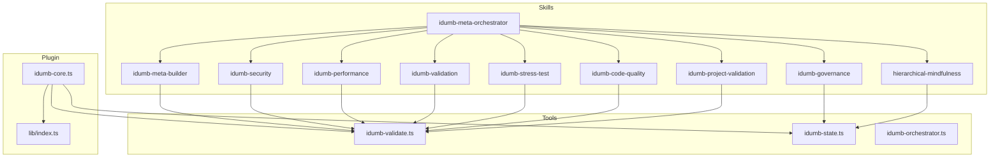
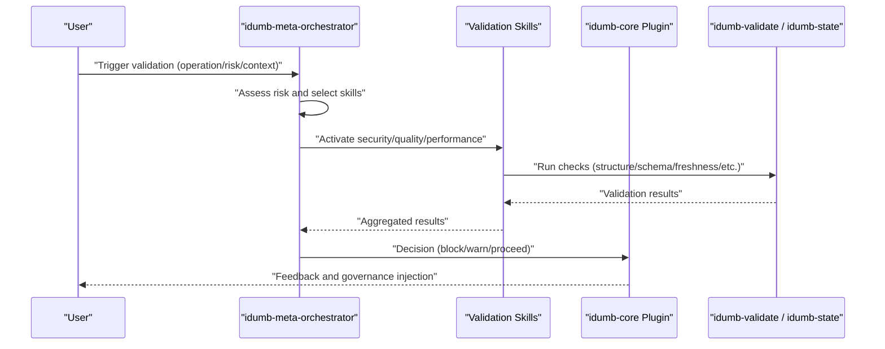
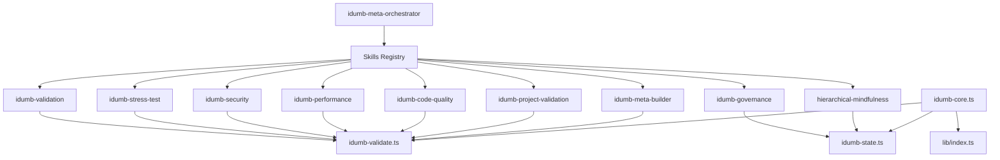

# Skill System

<cite>
**Referenced Files in This Document**
- [SKILL-ARCHITECTURE.md](file://src/skills/SKILL-ARCHITECTURE.md)
- [idumb-governance/SKILL.md](file://src/skills/idumb-governance/SKILL.md)
- [idumb-meta-builder/SKILL.md](file://src/skills/idumb-meta-builder/SKILL.md)
- [idumb-security/SKILL.md](file://src/skills/idumb-security/SKILL.md)
- [idumb-performance/SKILL.md](file://src/skills/idumb-performance/SKILL.md)
- [idumb-stress-test/SKILL.md](file://src/skills/idumb-stress-test/SKILL.md)
- [idumb-validation/SKILL.md](file://src/skills/idumb-validation/SKILL.md)
- [idumb-code-quality/SKILL.md](file://src/skills/idumb-code-quality/SKILL.md)
- [idumb-project-validation/SKILL.md](file://src/skills/idumb-project-validation/SKILL.md)
- [hierarchical-mindfulness/SKILL.md](file://src/skills/hierarchical-mindfulness/SKILL.md)
- [idumb-meta-orchestrator/SKILL.md](file://src/skills/idumb-meta-orchestrator/SKILL.md)
- [index.ts](file://src/plugins/lib/index.ts)
- [idumb-core.ts](file://src/plugins/idumb-core.ts)
- [idumb-validate.ts](file://src/tools/idumb-validate.ts)
- [idumb-state.ts](file://src/tools/idumb-state.ts)
- [idumb-orchestrator.ts](file://src/tools/idumb-orchestrator.ts)
</cite>

## Table of Contents
1. [Introduction](#introduction)
2. [Project Structure](#project-structure)
3. [Core Components](#core-components)
4. [Architecture Overview](#architecture-overview)
5. [Detailed Component Analysis](#detailed-component-analysis)
6. [Dependency Analysis](#dependency-analysis)
7. [Performance Considerations](#performance-considerations)
8. [Troubleshooting Guide](#troubleshooting-guide)
9. [Conclusion](#conclusion)

## Introduction
This document explains iDumb’s extensible validation and enhancement framework centered around its skill system. It covers the skill architecture, registration and invocation patterns, integration mechanisms, and the nine complementary skills that provide governance validation, meta-framework transformation, security enforcement, performance optimization, and stress testing. It also documents configuration, parameter passing, result processing, development guidelines, custom skill creation, and operational practices for debugging, monitoring, and maintenance.

## Project Structure
The skill system is organized as a set of modular, purpose-built skills under src/skills, each with a dedicated SKILL.md that defines its philosophy, categories, workflows, and integration points. A meta-orchestrator skill coordinates activation based on context, operation type, and risk level. Supporting tools and plugins provide validation, state management, and OpenCode integration hooks.

**Diagram sources**
- [idumb-meta-orchestrator/SKILL.md](file://src/skills/idumb-meta-orchestrator/SKILL.md#L36-L51)
- [idumb-governance/SKILL.md](file://src/skills/idumb-governance/SKILL.md#L49-L115)
- [idumb-meta-builder/SKILL.md](file://src/skills/idumb-meta-builder/SKILL.md#L135-L160)
- [idumb-security/SKILL.md](file://src/skills/idumb-security/SKILL.md#L236-L275)
- [idumb-performance/SKILL.md](file://src/skills/idumb-performance/SKILL.md#L361-L412)
- [idumb-validation/SKILL.md](file://src/skills/idumb-validation/SKILL.md#L72-L116)
- [idumb-stress-test/SKILL.md](file://src/skills/idumb-stress-test/SKILL.md#L113-L143)
- [idumb-code-quality/SKILL.md](file://src/skills/idumb-code-quality/SKILL.md#L375-L414)
- [idumb-project-validation/SKILL.md](file://src/skills/idumb-project-validation/SKILL.md#L562-L612)
- [hierarchical-mindfulness/SKILL.md](file://src/skills/hierarchical-mindfulness/SKILL.md#L96-L144)
- [idumb-validate.ts](file://src/tools/idumb-validate.ts#L1-L105)
- [idumb-state.ts](file://src/tools/idumb-state.ts#L61-L78)
- [idumb-orchestrator.ts](file://src/tools/idumb-orchestrator.ts#L257-L343)
- [idumb-core.ts](file://src/plugins/idumb-core.ts#L130-L189)
- [index.ts](file://src/plugins/lib/index.ts#L1-L131)

**Section sources**
- [SKILL-ARCHITECTURE.md](file://src/skills/SKILL-ARCHITECTURE.md#L13-L51)
- [idumb-meta-orchestrator/SKILL.md](file://src/skills/idumb-meta-orchestrator/SKILL.md#L36-L51)

## Core Components
- Skill registry and activation matrix: Defines which skills are activated for different operations and risk levels.
- Built-in skills:
  - idumb-governance: Governance structure, schema, and context anchoring.
  - idumb-meta-builder: Framework ingestion and transformation with self-upgrade.
  - idumb-security: Bash injection, path traversal, permission, and race condition prevention.
  - idumb-performance: File scanning optimization, cleanup, iteration limits, and resource monitoring.
  - idumb-validation: Three-layer validation (structure/integration/behavior) with iterative gap detection.
  - idumb-stress-test: Agent coordination, integration matrix, regression sweeps, and self-healing.
  - idumb-code-quality: Error handling, cross-platform compatibility, documentation, and error message standards.
  - idumb-project-validation: Greenfield/brownfield project validation and continuous governance.
  - hierarchical-mindfulness: Session state awareness, delegation depth, and chain enforcement.
  - idumb-meta-orchestrator: Automatic activation of validation skills based on context and risk.
- Tools and plugin:
  - idumb-validate.ts: Validation runner with structure, schema, freshness, planning alignment, and integration points.
  - idumb-state.ts: State read/write, anchors, history, and session management.
  - idumb-orchestrator.ts: Orchestration tool for pre-write, pre-delegate, phase transition, and skill activation.
  - idumb-core.ts and lib/index.ts: OpenCode plugin hooks for session lifecycle, permission enforcement, compaction, and governance injection.

**Section sources**
- [SKILL-ARCHITECTURE.md](file://src/skills/SKILL-ARCHITECTURE.md#L13-L51)
- [idumb-meta-orchestrator/SKILL.md](file://src/skills/idumb-meta-orchestrator/SKILL.md#L54-L88)
- [idumb-validate.ts](file://src/tools/idumb-validate.ts#L28-L105)
- [idumb-state.ts](file://src/tools/idumb-state.ts#L61-L78)
- [idumb-orchestrator.ts](file://src/tools/idumb-orchestrator.ts#L257-L343)
- [idumb-core.ts](file://src/plugins/idumb-core.ts#L130-L189)
- [index.ts](file://src/plugins/lib/index.ts#L1-L131)

## Architecture Overview
The meta-orchestrator coordinates skill activation based on operation type, risk level, and file type. It selects appropriate validation skills and runs them in parallel where feasible, aggregating results and making decisions based on blockers, warnings, and pass/fail outcomes. The plugin layer integrates with OpenCode to inject governance context, enforce permissions, track execution metrics, and manage compaction.

**Diagram sources**
- [idumb-meta-orchestrator/SKILL.md](file://src/skills/idumb-meta-orchestrator/SKILL.md#L94-L147)
- [idumb-orchestrator.ts](file://src/tools/idumb-orchestrator.ts#L257-L343)
- [idumb-validate.ts](file://src/tools/idumb-validate.ts#L402-L456)
- [idumb-core.ts](file://src/plugins/idumb-core.ts#L651-L741)

## Detailed Component Analysis

### Skill Registration and Invocation Patterns
- Registration: Each skill declares its purpose, metadata, and integration points in its SKILL.md. The orchestrator maintains a registry of skills and their responsibilities.
- Invocation:
  - Automatic activation: Based on operation type, risk level, and file type.
  - Manual activation: Through orchestration tools or commands.
  - Continuous monitoring: Background checks triggered by session events and time thresholds.
- Integration points: Skills read/write to .idumb/brain, src/*, and .opencode/ artifacts, and coordinate via the orchestrator.

**Section sources**
- [idumb-meta-orchestrator/SKILL.md](file://src/skills/idumb-meta-orchestrator/SKILL.md#L36-L51)
- [idumb-meta-orchestrator/SKILL.md](file://src/skills/idumb-meta-orchestrator/SKILL.md#L54-L88)
- [idumb-orchestrator.ts](file://src/tools/idumb-orchestrator.ts#L257-L343)

### Governance Validation (idumb-governance)
- Purpose: Enforce hierarchical delegation, validate state schema, and manage context anchoring.
- Key workflows:
  - Structure validation (.idumb/ directory integrity).
  - Schema validation (state.json required fields).
  - Freshness validation (stale files and anchors).
  - Planning alignment (sync with .planning/).
- Return formats: Structured validation and execution results with evidence and timestamps.

**Section sources**
- [idumb-governance/SKILL.md](file://src/skills/idumb-governance/SKILL.md#L118-L166)
- [idumb-governance/SKILL.md](file://src/skills/idumb-governance/SKILL.md#L168-L230)
- [idumb-governance/SKILL.md](file://src/skills/idumb-governance/SKILL.md#L290-L307)
- [idumb-validate.ts](file://src/tools/idumb-validate.ts#L28-L105)
- [idumb-validate.ts](file://src/tools/idumb-validate.ts#L107-L187)
- [idumb-validate.ts](file://src/tools/idumb-validate.ts#L189-L280)
- [idumb-validate.ts](file://src/tools/idumb-validate.ts#L282-L399)

### Meta-Framework Transformation (idumb-meta-builder)
- Purpose: Ingest external frameworks (e.g., BMAD), classify patterns, transform to iDumb equivalents, validate, integrate, and evolve transformation rules.
- Workflow: Discovery → Extraction → Classification → Transformation → Validation → Integration → Evolution.
- Self-upgrade: Uses validation feedback to refine transformation rules.

**Section sources**
- [idumb-meta-builder/SKILL.md](file://src/skills/idumb-meta-builder/SKILL.md#L135-L160)
- [idumb-meta-builder/SKILL.md](file://src/skills/idumb-meta-builder/SKILL.md#L252-L271)
- [idumb-meta-builder/SKILL.md](file://src/skills/idumb-meta-builder/SKILL.md#L299-L320)
- [idumb-meta-builder/SKILL.md](file://src/skills/idumb-meta-builder/SKILL.md#L354-L373)

### Security Enforcement (idumb-security)
- Categories: Bash injection prevention, path traversal, permission bypass, race condition prevention.
- Validation workflow: Pre-write and pre-delegate checks with atomic file operations and permission matrix validation.
- Scripts: validate-bash.sh, sanitize-path.sh, validate-permissions.sh, file-lock.sh.

**Section sources**
- [idumb-security/SKILL.md](file://src/skills/idumb-security/SKILL.md#L35-L80)
- [idumb-security/SKILL.md](file://src/skills/idumb-security/SKILL.md#L82-L136)
- [idumb-security/SKILL.md](file://src/skills/idumb-security/SKILL.md#L138-L181)
- [idumb-security/SKILL.md](file://src/skills/idumb-security/SKILL.md#L183-L232)
- [idumb-security/SKILL.md](file://src/skills/idumb-security/SKILL.md#L236-L275)
- [idumb-security/SKILL.md](file://src/skills/idumb-security/SKILL.md#L279-L332)

### Performance Optimization (idumb-performance)
- Categories: Efficient file scanning, memory leak prevention, iteration limits, batch operations, resource usage monitoring.
- Optimization workflow: Detect performance issues → Apply optimizations → Validate improvements.
- Scripts: efficient-scan.sh, cleanup-policy.sh, validate-iteration-limits.sh, batch-operations.sh, monitor-resources.sh.

**Section sources**
- [idumb-performance/SKILL.md](file://src/skills/idumb-performance/SKILL.md#L35-L104)
- [idumb-performance/SKILL.md](file://src/skills/idumb-performance/SKILL.md#L106-L175)
- [idumb-performance/SKILL.md](file://src/skills/idumb-performance/SKILL.md#L177-L252)
- [idumb-performance/SKILL.md](file://src/skills/idumb-performance/SKILL.md#L254-L306)
- [idumb-performance/SKILL.md](file://src/skills/idumb-performance/SKILL.md#L308-L357)
- [idumb-performance/SKILL.md](file://src/skills/idumb-performance/SKILL.md#L361-L412)
- [idumb-performance/SKILL.md](file://src/skills/idumb-performance/SKILL.md#L416-L425)
- [idumb-performance/SKILL.md](file://src/skills/idumb-performance/SKILL.md#L428-L473)

### Validation and Gap Detection (idumb-validation)
- Philosophy: Completion-driven validation with iterative gap detection and self-healing workflows.
- Three-layer model: Structure → Integration → Behavior.
- Integration point thresholds: 30+ (agents/workflows), 15+ (tools/commands), 10+ (configs).
- Iterative lifecycle: Detect → Assess → Resolve → Verify.

**Section sources**
- [idumb-validation/SKILL.md](file://src/skills/idumb-validation/SKILL.md#L24-L46)
- [idumb-validation/SKILL.md](file://src/skills/idumb-validation/SKILL.md#L72-L87)
- [idumb-validation/SKILL.md](file://src/skills/idumb-validation/SKILL.md#L450-L561)
- [idumb-validation/SKILL.md](file://src/skills/idumb-validation/SKILL.md#L564-L607)
- [idumb-validate.ts](file://src/tools/idumb-validate.ts#L458-L754)

### Stress Testing (idumb-stress-test)
- Activation modes: Micro (real-time), Batch (phase transition), Full (comprehensive).
- Categories: Agent coordination tests, integration matrix tests, regression sweep tests.
- Conflict and gap detection with self-healing protocol and iteration loop controller.

**Section sources**
- [idumb-stress-test/SKILL.md](file://src/skills/idumb-stress-test/SKILL.md#L36-L110)
- [idumb-stress-test/SKILL.md](file://src/skills/idumb-stress-test/SKILL.md#L113-L213)
- [idumb-stress-test/SKILL.md](file://src/skills/idumb-stress-test/SKILL.md#L286-L378)
- [idumb-stress-test/SKILL.md](file://src/skills/idumb-stress-test/SKILL.md#L382-L451)
- [idumb-stress-test/SKILL.md](file://src/skills/idumb-stress-test/SKILL.md#L518-L570)
- [idumb-stress-test/SKILL.md](file://src/skills/idumb-stress-test/SKILL.md#L574-L631)

### Code Quality (idumb-code-quality)
- Categories: Error handling standards, cross-platform compatibility, documentation, error message format, code duplication.
- Validation workflow: Code review validation and automated testing.
- Scripts: validate-error-handling.sh, validate-cross-platform.sh, validate-documentation.sh, validate-error-messages.sh, detect-duplication.sh.

**Section sources**
- [idumb-code-quality/SKILL.md](file://src/skills/idumb-code-quality/SKILL.md#L35-L111)
- [idumb-code-quality/SKILL.md](file://src/skills/idumb-code-quality/SKILL.md#L113-L201)
- [idumb-code-quality/SKILL.md](file://src/skills/idumb-code-quality/SKILL.md#L203-L275)
- [idumb-code-quality/SKILL.md](file://src/skills/idumb-code-quality/SKILL.md#L277-L336)
- [idumb-code-quality/SKILL.md](file://src/skills/idumb-code-quality/SKILL.md#L338-L371)
- [idumb-code-quality/SKILL.md](file://src/skills/idumb-code-quality/SKILL.md#L375-L414)
- [idumb-code-quality/SKILL.md](file://src/skills/idumb-code-quality/SKILL.md#L418-L427)

### Project Validation (idumb-project-validation)
- Modes: Pre-flight, continuous, health-check.
- Project type detection: Greenfield vs brownfield, complexity assessment.
- Bootstrap and integration workflows for both project types.
- OpenCode compatibility checks and non-blocking validation behavior.

**Section sources**
- [idumb-project-validation/SKILL.md](file://src/skills/idumb-project-validation/SKILL.md#L36-L113)
- [idumb-project-validation/SKILL.md](file://src/skills/idumb-project-validation/SKILL.md#L117-L251)
- [idumb-project-validation/SKILL.md](file://src/skills/idumb-project-validation/SKILL.md#L255-L334)
- [idumb-project-validation/SKILL.md](file://src/skills/idumb-project-validation/SKILL.md#L337-L433)
- [idumb-project-validation/SKILL.md](file://src/skills/idumb-project-validation/SKILL.md#L437-L501)
- [idumb-project-validation/SKILL.md](file://src/skills/idumb-project-validation/SKILL.md#L505-L558)
- [idumb-project-validation/SKILL.md](file://src/skills/idumb-project-validation/SKILL.md#L562-L612)
- [idumb-project-validation/SKILL.md](file://src/skills/idumb-project-validation/SKILL.md#L616-L683)

### Hierarchical Mindfulness (hierarchical-mindfulness)
- Philosophy: Mindful orchestration with hierarchy-first, context awareness, and evidence-based delegation.
- Session state awareness: Lifecycle detection, delegation depth tracking, governance level assessment.
- Orchestration protocol: Assess position → Delegate mindfully → Validate return.
- Chain enforcement and session resumption protocols.

**Section sources**
- [hierarchical-mindfulness/SKILL.md](file://src/skills/hierarchical-mindfulness/SKILL.md#L21-L52)
- [hierarchical-mindfulness/SKILL.md](file://src/skills/hierarchical-mindfulness/SKILL.md#L55-L94)
- [hierarchical-mindfulness/SKILL.md](file://src/skills/hierarchical-mindfulness/SKILL.md#L96-L144)
- [hierarchical-mindfulness/SKILL.md](file://src/skills/hierarchical-mindfulness/SKILL.md#L147-L227)
- [hierarchical-mindfulness/SKILL.md](file://src/skills/hierarchical-mindfulness/SKILL.md#L230-L287)

### Meta-Orchestrator (idumb-meta-orchestrator)
- Skill registry: Coordinates idumb-security, idumb-code-quality, idumb-performance, idumb-validation, idumb-governance, hierarchical-mindfulness, idumb-project-validation, idumb-stress-test, idumb-meta-builder.
- Activation matrix: By operation type, risk level, and file type.
- Orchestration workflows: Pre-write, pre-delegate, phase-transition, continuous monitoring.
- Activation rules: Critical security first, code quality on creation, performance on batch operations, validation at boundaries, governance on delegation.

**Section sources**
- [idumb-meta-orchestrator/SKILL.md](file://src/skills/idumb-meta-orchestrator/SKILL.md#L36-L51)
- [idumb-meta-orchestrator/SKILL.md](file://src/skills/idumb-meta-orchestrator/SKILL.md#L54-L88)
- [idumb-meta-orchestrator/SKILL.md](file://src/skills/idumb-meta-orchestrator/SKILL.md#L94-L223)
- [idumb-meta-orchestrator/SKILL.md](file://src/skills/idumb-meta-orchestrator/SKILL.md#L254-L319)
- [idumb-meta-orchestrator/SKILL.md](file://src/skills/idumb-meta-orchestrator/SKILL.md#L323-L372)

### Tools and Plugin Integration
- idumb-validate.ts: Runs structure, schema, freshness, planning alignment, and integration points validation; returns structured results.
- idumb-state.ts: Manages .idumb/brain/state.json, anchors, history, and session records; supports garbage collection.
- idumb-orchestrator.ts: Provides orchestration APIs for pre-write, pre-delegate, phase transition, and manual skill activation.
- idumb-core.ts and lib/index.ts: OpenCode plugin hooks for session lifecycle, permission enforcement, compaction, governance injection, and execution metrics.

**Section sources**
- [idumb-validate.ts](file://src/tools/idumb-validate.ts#L28-L105)
- [idumb-validate.ts](file://src/tools/idumb-validate.ts#L107-L187)
- [idumb-validate.ts](file://src/tools/idumb-validate.ts#L189-L280)
- [idumb-validate.ts](file://src/tools/idumb-validate.ts#L282-L399)
- [idumb-validate.ts](file://src/tools/idumb-validate.ts#L401-L456)
- [idumb-validate.ts](file://src/tools/idumb-validate.ts#L458-L754)
- [idumb-state.ts](file://src/tools/idumb-state.ts#L61-L78)
- [idumb-state.ts](file://src/tools/idumb-state.ts#L112-L150)
- [idumb-state.ts](file://src/tools/idumb-state.ts#L152-L179)
- [idumb-state.ts](file://src/tools/idumb-state.ts#L181-L206)
- [idumb-state.ts](file://src/tools/idumb-state.ts#L234-L324)
- [idumb-state.ts](file://src/tools/idumb-state.ts#L326-L388)
- [idumb-state.ts](file://src/tools/idumb-state.ts#L439-L553)
- [idumb-orchestrator.ts](file://src/tools/idumb-orchestrator.ts#L257-L343)
- [idumb-orchestrator.ts](file://src/tools/idumb-orchestrator.ts#L345-L390)
- [idumb-orchestrator.ts](file://src/tools/idumb-orchestrator.ts#L392-L431)
- [idumb-orchestrator.ts](file://src/tools/idumb-orchestrator.ts#L433-L470)
- [idumb-orchestrator.ts](file://src/tools/idumb-orchestrator.ts#L472-L512)
- [idumb-core.ts](file://src/plugins/idumb-core.ts#L130-L189)
- [idumb-core.ts](file://src/plugins/idumb-core.ts#L347-L378)
- [idumb-core.ts](file://src/plugins/idumb-core.ts#L446-L645)
- [idumb-core.ts](file://src/plugins/idumb-core.ts#L651-L741)
- [index.ts](file://src/plugins/lib/index.ts#L1-L131)

## Dependency Analysis
The skill system exhibits low coupling and high cohesion:
- Each skill encapsulates a distinct domain with minimal overlap.
- The orchestrator decouples activation logic from skill implementations.
- Tools and plugin modules provide shared utilities for validation, state, and OpenCode integration.

**Diagram sources**
- [idumb-meta-orchestrator/SKILL.md](file://src/skills/idumb-meta-orchestrator/SKILL.md#L36-L51)
- [idumb-validate.ts](file://src/tools/idumb-validate.ts#L1-L105)
- [idumb-state.ts](file://src/tools/idumb-state.ts#L61-L78)
- [idumb-core.ts](file://src/plugins/idumb-core.ts#L130-L189)
- [index.ts](file://src/plugins/lib/index.ts#L1-L131)

**Section sources**
- [SKILL-ARCHITECTURE.md](file://src/skills/SKILL-ARCHITECTURE.md#L45-L96)
- [idumb-meta-orchestrator/SKILL.md](file://src/skills/idumb-meta-orchestrator/SKILL.md#L36-L51)

## Performance Considerations
- Parallel execution: The orchestrator can run multiple validations concurrently to reduce latency.
- Lightweight checks: Micro-validations (<5s) and batch validations (<60s) balance thoroughness and responsiveness.
- Iteration limits: Performance skill enforces iteration limits to prevent infinite loops.
- Resource monitoring: Periodic checks for disk usage, open file handles, and memory consumption.
- Cleanup policies: Automated removal of old validation records and anchors to prevent accumulation.

**Section sources**
- [idumb-meta-orchestrator/SKILL.md](file://src/skills/idumb-meta-orchestrator/SKILL.md#L225-L250)
- [idumb-stress-test/SKILL.md](file://src/skills/idumb-stress-test/SKILL.md#L36-L110)
- [idumb-performance/SKILL.md](file://src/skills/idumb-performance/SKILL.md#L177-L252)
- [idumb-performance/SKILL.md](file://src/skills/idumb-performance/SKILL.md#L308-L357)
- [idumb-performance/SKILL.md](file://src/skills/idumb-performance/SKILL.md#L416-L425)

## Troubleshooting Guide
Common issues and remedies:
- Validation failures:
  - Use idumb-validate to identify failing checks and their evidence.
  - Review integration point matrices and thresholds.
- Permission violations:
  - Confirm agent permissions and delegation paths.
  - Use hierarchical-mindfulness to detect chain violations.
- Stale context:
  - Refresh state.json and anchors; consider creating checkpoints.
- Performance bottlenecks:
  - Apply efficient scanning patterns and iteration limit validation.
  - Monitor resource usage and run cleanup policies.
- Self-healing:
  - Utilize stress-test self-healing protocol for auto-fixable issues.
  - Escalate unresolved gaps with stall detection and escalation protocol.

**Section sources**
- [idumb-validate.ts](file://src/tools/idumb-validate.ts#L401-L456)
- [idumb-governance/SKILL.md](file://src/skills/idumb-governance/SKILL.md#L259-L286)
- [hierarchical-mindfulness/SKILL.md](file://src/skills/hierarchical-mindfulness/SKILL.md#L254-L287)
- [idumb-performance/SKILL.md](file://src/skills/idumb-performance/SKILL.md#L308-L357)
- [idumb-stress-test/SKILL.md](file://src/skills/idumb-stress-test/SKILL.md#L520-L570)
- [idumb-stress-test/SKILL.md](file://src/skills/idumb-stress-test/SKILL.md#L564-L607)

## Conclusion
iDumb’s skill system provides a robust, extensible framework for governance, security, performance, validation, and stress testing. Its meta-orchestrator coordinates activation intelligently, while modular skills maintain focused responsibilities. The integration with OpenCode via plugins ensures seamless governance injection, permission enforcement, and session lifecycle management. Developers can extend the system by adding new skills aligned with the non-overlapping design principles and leveraging the provided tools and plugin hooks.