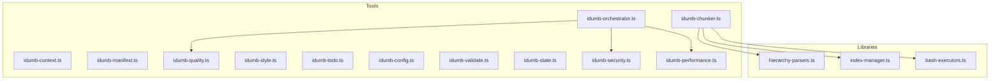
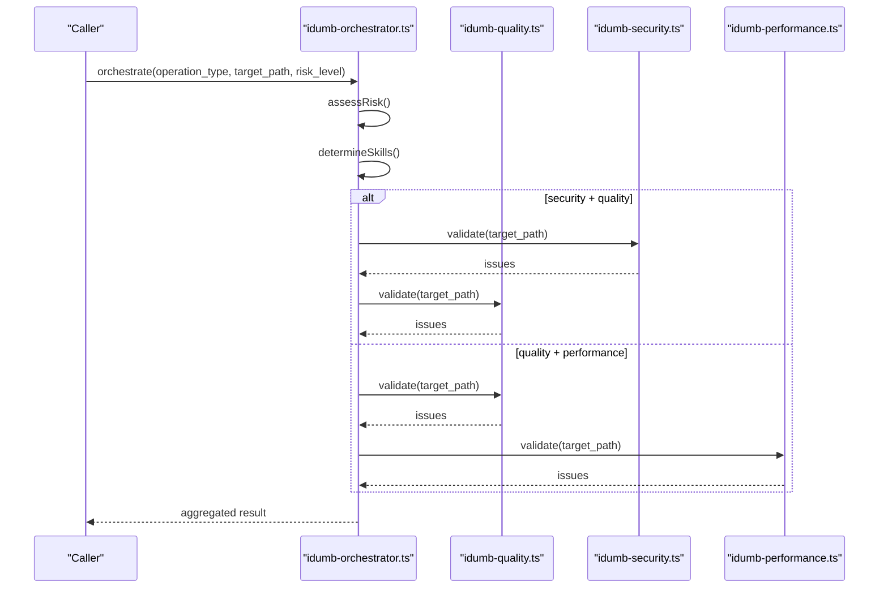
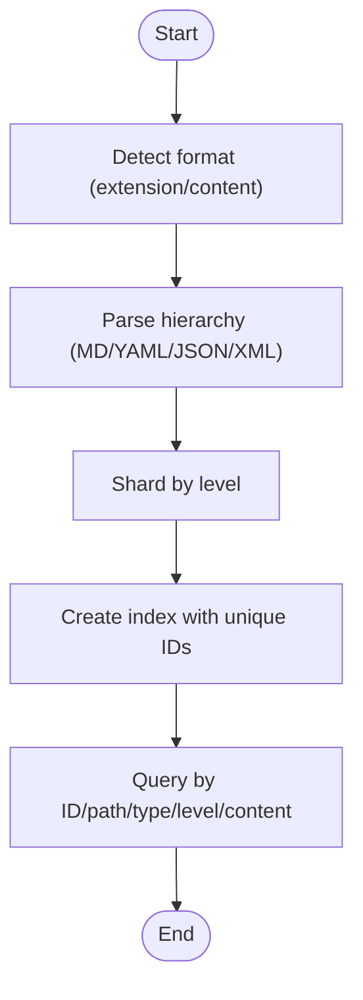
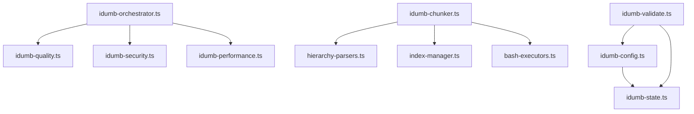

# Utility Tools

<cite>
**Referenced Files in This Document**
- [idumb-chunker.ts](file://src/tools/idumb-chunker.ts)
- [idumb-context.ts](file://src/tools/idumb-context.ts)
- [idumb-manifest.ts](file://src/tools/idumb-manifest.ts)
- [idumb-quality.ts](file://src/tools/idumb-quality.ts)
- [idumb-style.ts](file://src/tools/idumb-style.ts)
- [idumb-todo.ts](file://src/tools/idumb-todo.ts)
- [idumb-config.ts](file://src/tools/idumb-config.ts)
- [idumb-orchestrator.ts](file://src/tools/idumb-orchestrator.ts)
- [idumb-validate.ts](file://src/tools/idumb-validate.ts)
- [idumb-state.ts](file://src/tools/idumb-state.ts)
- [idumb-security.ts](file://src/tools/idumb-security.ts)
- [idumb-performance.ts](file://src/tools/idumb-performance.ts)
- [hierarchy-parsers.ts](file://src/tools/lib/hierarchy-parsers.ts)
- [index-manager.ts](file://src/tools/lib/index-manager.ts)
- [bash-executors.ts](file://src/tools/lib/bash-executors.ts)
</cite>

## Table of Contents
1. [Introduction](#introduction)
2. [Project Structure](#project-structure)
3. [Core Components](#core-components)
4. [Architecture Overview](#architecture-overview)
5. [Detailed Component Analysis](#detailed-component-analysis)
6. [Dependency Analysis](#dependency-analysis)
7. [Performance Considerations](#performance-considerations)
8. [Troubleshooting Guide](#troubleshooting-guide)
9. [Conclusion](#conclusion)

## Introduction
This document provides comprehensive documentation for iDumb Utility Tools, focusing on supporting capabilities for text processing, context management, manifest generation, quality assessment, style enforcement, and TODO management. It explains the APIs, configuration options, integration patterns, performance characteristics, error handling, and best practices for composing these tools effectively.

## Project Structure
The utility tools are implemented as modular TypeScript modules under the `src/tools` directory. Each tool exposes one or more functions wrapped with the `@opencode-ai/plugin` tool decorator, enabling standardized invocation and argument validation. Supporting libraries under `src/tools/lib` provide specialized functionality for hierarchical parsing, indexing, and bash-based operations.

**Diagram sources**
- [idumb-chunker.ts](file://src/tools/idumb-chunker.ts#L1-L930)
- [idumb-orchestrator.ts](file://src/tools/idumb-orchestrator.ts#L1-L527)
- [hierarchy-parsers.ts](file://src/tools/lib/hierarchy-parsers.ts#L1-L567)
- [index-manager.ts](file://src/tools/lib/index-manager.ts#L1-L373)
- [bash-executors.ts](file://src/tools/lib/bash-executors.ts#L1-L429)

**Section sources**
- [idumb-chunker.ts](file://src/tools/idumb-chunker.ts#L1-L930)
- [idumb-context.ts](file://src/tools/idumb-context.ts#L1-L277)
- [idumb-manifest.ts](file://src/tools/idumb-manifest.ts#L1-L598)
- [idumb-quality.ts](file://src/tools/idumb-quality.ts#L1-L524)
- [idumb-style.ts](file://src/tools/idumb-style.ts#L1-L196)
- [idumb-todo.ts](file://src/tools/idumb-todo.ts#L1-L385)
- [idumb-config.ts](file://src/tools/idumb-config.ts#L1-L1024)
- [idumb-orchestrator.ts](file://src/tools/idumb-orchestrator.ts#L1-L527)
- [idumb-validate.ts](file://src/tools/idumb-validate.ts#L1-L1043)
- [idumb-state.ts](file://src/tools/idumb-state.ts#L1-L599)
- [idumb-security.ts](file://src/tools/idumb-security.ts#L1-L359)
- [idumb-performance.ts](file://src/tools/idumb-performance.ts#L1-L533)
- [hierarchy-parsers.ts](file://src/tools/lib/hierarchy-parsers.ts#L1-L567)
- [index-manager.ts](file://src/tools/lib/index-manager.ts#L1-L373)
- [bash-executors.ts](file://src/tools/lib/bash-executors.ts#L1-L429)

## Core Components
- Text Processing and Chunking: idumb-chunker provides chunked reading, hierarchical parsing, indexing, fast extraction, and targeted editing for structured documents.
- Context Management: idumb-context classifies project context, detects frameworks, and summarizes state for compaction.
- Manifest Generation: idumb-manifest snapshots codebase structure, detects drift, identifies conflicts, and verifies git integrity.
- Quality Assessment: idumb-quality validates error handling, cross-platform compatibility, and documentation completeness.
- Style Enforcement: idumb-style manages output styles for consistent presentation.
- TODO Management: idumb-todo maintains hierarchical tasks with prefixes, status tracking, and synchronization with external systems.
- Configuration Management: idumb-config ensures the master configuration exists, merges planning settings, and enforces governance rules.
- Orchestration: idumb-orchestrator coordinates validation across security, quality, and performance based on risk and operation type.
- Validation Suite: idumb-validate checks structure, schema, freshness, planning alignment, and integration points.
- State Management: idumb-state reads/writes governance state, anchors, history, and session records.
- Security Validation: idumb-security scans bash scripts for injection, traversal, permission bypass, and race conditions.
- Performance Validation: idumb-performance evaluates scanning efficiency, memory safety, iteration limits, and resource usage.

**Section sources**
- [idumb-chunker.ts](file://src/tools/idumb-chunker.ts#L123-L930)
- [idumb-context.ts](file://src/tools/idumb-context.ts#L24-L208)
- [idumb-manifest.ts](file://src/tools/idumb-manifest.ts#L370-L598)
- [idumb-quality.ts](file://src/tools/idumb-quality.ts#L419-L524)
- [idumb-style.ts](file://src/tools/idumb-style.ts#L23-L196)
- [idumb-todo.ts](file://src/tools/idumb-todo.ts#L100-L385)
- [idumb-config.ts](file://src/tools/idumb-config.ts#L652-L1024)
- [idumb-orchestrator.ts](file://src/tools/idumb-orchestrator.ts#L257-L527)
- [idumb-validate.ts](file://src/tools/idumb-validate.ts#L28-L456)
- [idumb-state.ts](file://src/tools/idumb-state.ts#L82-L599)
- [idumb-security.ts](file://src/tools/idumb-security.ts#L247-L359)
- [idumb-performance.ts](file://src/tools/idumb-performance.ts#L380-L533)

## Architecture Overview
The tools integrate through a unified plugin framework. The orchestrator coordinates validation across specialized tools, while libraries provide reusable functionality for hierarchical parsing, indexing, and bash-based operations.

**Diagram sources**
- [idumb-orchestrator.ts](file://src/tools/idumb-orchestrator.ts#L257-L343)
- [idumb-security.ts](file://src/tools/idumb-security.ts#L247-L359)
- [idumb-quality.ts](file://src/tools/idumb-quality.ts#L419-L524)
- [idumb-performance.ts](file://src/tools/idumb-performance.ts#L380-L533)

## Detailed Component Analysis

### Text Processing and Chunking (idumb-chunker)
- Purpose: Read long documents in chunks, validate governance compliance, append content, parse hierarchical data, shard by levels, index nodes, extract via bash or native parsers, insert/edit at hierarchy positions.
- Key APIs:
  - read: Sequential chunk retrieval with metadata.
  - overview: Document structure and recommended chunk sizes.
  - validate: Governance and frontmatter validation.
  - append: Controlled content appending with optional section placement.
  - parseHierarchy: Hierarchical parsing for XML, YAML, JSON, Markdown.
  - shard: Level-based sharding for parallel processing.
  - index: Create searchable indexes with unique IDs.
  - extract: Fast extraction using jq/yq/xmllint or native parsing.
  - insert: Fast insertion using sed or native edit.
  - targetEdit: Edit content at specific hierarchy node.
- Configuration and Behavior:
  - Chunk size defaults and safety limits.
  - Auto-detection of formats and fallbacks.
  - Bash tool availability caching and fallbacks.
  - Index caching with staleness checks.
- Integration Patterns:
  - Works with hierarchical-parsers and index-manager libraries.
  - Uses bash-executors for performance on large files.
- Examples:
  - Read first chunk: idumb-chunker.read({ path: "docs/spec.md" })
  - Validate governance: idumb-chunker.validate({ path: "docs/PLAN.md", rules: "governance" })
  - Parse hierarchy: idumb-chunker.parseHierarchy({ path: "config.yaml", format: "yaml" })
  - Index and query: idumb-chunker.index({ path: "data.json" }), idumb-chunker.extract({ path: "data.json", query: "$.dependencies" })
- Performance Characteristics:
  - Native parsing scales with file size; bash tools optimized for large files (>100KB).
  - Indexing supports fast lookup with cache invalidation.
- Error Handling:
  - Graceful handling of missing files, invalid formats, and tool unavailability.
- Best Practices:
  - Use overview to estimate chunk sizes.
  - Prefer bash extraction for large JSON/YAML/XML.
  - Reuse cached indexes when possible.

**Section sources**
- [idumb-chunker.ts](file://src/tools/idumb-chunker.ts#L123-L930)
- [hierarchy-parsers.ts](file://src/tools/lib/hierarchy-parsers.ts#L440-L485)
- [index-manager.ts](file://src/tools/lib/index-manager.ts#L111-L155)
- [bash-executors.ts](file://src/tools/lib/bash-executors.ts#L82-L126)

#### Hierarchical Parsing and Indexing

**Diagram sources**
- [hierarchy-parsers.ts](file://src/tools/lib/hierarchy-parsers.ts#L22-L463)
- [index-manager.ts](file://src/tools/lib/index-manager.ts#L111-L315)

### Context Management (idumb-context)
- Purpose: Classify project type, detect frameworks, analyze languages, and summarize state for compaction.
- Key APIs:
  - default export: Classify project context.
  - summary: Brief context summary for compaction.
  - patterns: Detect specific patterns (API, database, auth, testing, UI, state).
- Configuration and Behavior:
  - Reads package.json, workspace configs, and planning directories.
  - Detects monorepos, libraries, applications, and frameworks.
- Integration Patterns:
  - Used by orchestrator and state management for context-aware decisions.
- Examples:
  - Classify: idumb-context()
  - Summary: idumb-context.summary()
  - Patterns: idumb-context.patterns({ pattern: "api" })

**Section sources**
- [idumb-context.ts](file://src/tools/idumb-context.ts#L24-L277)

### Manifest Generation (idumb-manifest)
- Purpose: Snapshot codebase structure, detect drift, identify conflicts, and verify git integrity.
- Key APIs:
  - snapshot: Create or update manifest with file categorization.
  - drift: Check for drift from last snapshot.
  - conflicts: Detect naming conflicts and circular dependencies.
  - verifyGitHash: Verify current git state for atomic commits.
  - default export: Full manifest check (snapshot + drift + conflicts).
- Configuration and Behavior:
  - Scans directories excluding node_modules, .git, dist, build, .next, .idumb.
  - Categorizes files by domain and layer.
  - Detects drift via hashes and git status.
- Integration Patterns:
  - Integrates with planning STATE.md for phase tracking.
- Examples:
  - Snapshot: idumb-manifest.snapshot()
  - Drift: idumb-manifest.drift()
  - Conflicts: idumb-manifest.conflicts()
  - Git verify: idumb-manifest.verifyGitHash({ expectedHash: "abc123" })

**Section sources**
- [idumb-manifest.ts](file://src/tools/idumb-manifest.ts#L370-L598)

### Quality Assessment (idumb-quality)
- Purpose: Validate error handling, cross-platform compatibility, and documentation completeness.
- Key APIs:
  - validate: Validate single file or directory with configurable checks.
  - checkDocs: Documentation coverage check.
  - checkErrors: Error handling patterns check.
  - default export: Comprehensive validation.
- Configuration and Behavior:
  - Checks for missing error handlers, platform-specific commands, missing docs, and inconsistent formatting.
  - Supports TypeScript, JavaScript, Bash, and Markdown.
- Integration Patterns:
  - Used by orchestrator for quality validation.
- Examples:
  - Validate file: idumb-quality.validate({ target_path: "scripts/deploy.sh" })
  - Docs check: idumb-quality.checkDocs({ target: "README.md" })
  - Directory scan: idumb-quality.validate({ target_path: "src", checks: ["error-handling"] })

**Section sources**
- [idumb-quality.ts](file://src/tools/idumb-quality.ts#L419-L524)

### Style Enforcement (idumb-style)
- Purpose: Manage output styles for consistent presentation.
- Key APIs:
  - list: List available styles with current selection.
  - set: Set active style with history tracking.
  - info: Show detailed style information.
  - reset: Reset to default style.
  - default export: Module exports for list/set/info/reset.
- Configuration and Behavior:
  - Persists active style and history in state.
  - Loads styles from styles directory.
- Integration Patterns:
  - Used by agents and commands to enforce consistent output formatting.
- Examples:
  - List styles: idumb-style.list()
  - Set style: idumb-style.set({ style: "verbose" })
  - Info: idumb-style.info({ style: "governance" })
  - Reset: idumb-style.reset()

**Section sources**
- [idumb-style.ts](file://src/tools/idumb-style.ts#L23-L196)

### TODO Management (idumb-todo)
- Purpose: Hierarchical task management with governance prefixes, metadata, and status tracking.
- Key APIs:
  - create: Create task with optional priority and metadata.
  - update: Update status, content, or priority.
  - complete: Mark task as completed with optional notes.
  - list: List tasks with filtering by status, priority, or prefix.
  - hierarchy: Organize tasks by hierarchical prefixes.
  - sync: Sync with external TODO systems.
  - default export: Read all tasks.
- Configuration and Behavior:
  - Prefixes include P1, P2, P3, V, B, GAP, BLOCKER, MAJOR, TEST.
  - Maintains completion counts and timestamps.
- Integration Patterns:
  - Synchronizes with OpenCode's TODO system.
- Examples:
  - Create task: idumb-todo.create({ content: "[P1] Implement validation", priority: "high" })
  - Update: idumb-todo.update({ id: "todo-...", status: "in_progress" })
  - List filtered: idumb-todo.list({ prefix: "P1", status: "pending" })
  - Hierarchy: idumb-todo.hierarchy()

**Section sources**
- [idumb-todo.ts](file://src/tools/idumb-todo.ts#L100-L385)

### Configuration Management (idumb-config)
- Purpose: Ensure master configuration exists, merge planning settings, and enforce governance rules.
- Key APIs:
  - read: Read configuration with planning integration.
  - update: Update configuration values with reserved-key protection.
  - init: Initialize with defaults and planning detection.
  - status: Get current hierarchy and status.
  - sync: Sync with .planning/config.json.
  - ensure: Ensure config exists (called at session start).
  - default export: Full read with planning integration.
- Configuration and Behavior:
  - Enforces experience levels (pro, guided, strict) affecting automation modes.
  - Protects critical sections and reserved keys.
  - Detects drift between config and planning artifacts.
- Integration Patterns:
  - Called at session start by all agents.
- Examples:
  - Read: idumb-config.read({ section: "automation" })
  - Update: idumb-config.update({ section: "user", key: "experience", value: "strict" })
  - Init: idumb-config.init({ experience: "guided" })
  - Status: idumb-config.status()

**Section sources**
- [idumb-config.ts](file://src/tools/idumb-config.ts#L652-L1024)

### Orchestration (idumb-orchestrator)
- Purpose: Coordinate validation across security, quality, and performance based on operation type and risk.
- Key APIs:
  - orchestrate: Main orchestration with risk assessment and skill activation.
  - preWrite: Pre-write validation hook.
  - preDelegate: Pre-delegation validation.
  - phaseTransition: Phase boundary validation.
  - activateSkills: Manual skill activation.
  - default export: Simplified orchestration.
- Configuration and Behavior:
  - Determines risk by operation type, file type, path, and size.
  - Activates appropriate skills (security, quality, performance).
- Integration Patterns:
  - Integrates with validation tools for comprehensive checks.
- Examples:
  - Orchestrate: idumb-orchestrator.orchestrate({ operation_type: "create", target_path: "scripts/init.sh" })
  - Pre-write: idumb-orchestrator.preWrite({ file_path: "scripts/deploy.sh", content: "#!/bin/bash ..." })
  - Pre-delegate: idumb-orchestrator.preDelegate({ parent_agent: "builder", child_agent: "validator" })

**Section sources**
- [idumb-orchestrator.ts](file://src/tools/idumb-orchestrator.ts#L257-L527)

### Validation Suite (idumb-validate)
- Purpose: Comprehensive validation of structure, schema, freshness, planning alignment, and integration points.
- Key APIs:
  - structure: Validate .idumb directory structure.
  - schema: Validate state.json schema.
  - freshness: Check for stale context.
  - planningAlignment: Align iDumb state with planning artifacts.
  - integrationPoints: Validate agent/command/tool integration points.
  - default export: Full validation across scopes.
- Configuration and Behavior:
  - Reports overall status and categorized issues.
  - Parses YAML frontmatter for integration validation.
- Integration Patterns:
  - Used for governance checks and readiness assessments.
- Examples:
  - Structure: idumb-validate.structure()
  - Schema: idumb-validate.schema()
  - Freshness: idumb-validate.freshness({ maxAgeHours: 48 })
  - Alignment: idumb-validate.planningAlignment()
  - Integration: idumb-validate.integrationPoints()

**Section sources**
- [idumb-validate.ts](file://src/tools/idumb-validate.ts#L28-L456)

### State Management (idumb-state)
- Purpose: Read/write governance state, manage anchors, history, and sessions.
- Key APIs:
  - read: Read state with smart delegation enhancements.
  - write: Update state fields.
  - anchor: Add context anchors with priority filtering.
  - history: Record action history.
  - getAnchors: Retrieve anchors for compaction.
  - createSession/modifySession/exportSession/listSessions/purgeOldSessions: Session lifecycle management.
- Configuration and Behavior:
  - Maintains last 50 history entries and caps anchors.
  - Supports session tracking and export for long-term storage.
- Integration Patterns:
  - Enhances context for research agents automatically.
- Examples:
  - Read: idumb-state.read({ includeContext: true, readableFormat: true })
  - Write: idumb-state.write({ phase: "planning", incrementValidation: true })
  - Anchor: idumb-state.anchor({ type: "decision", content: "Use jq for JSON parsing", priority: "high" })
  - Sessions: idumb-state.createSession({ sessionId: "sess-123", phase: "planning" })

**Section sources**
- [idumb-state.ts](file://src/tools/idumb-state.ts#L82-L599)

### Security Validation (idumb-security)
- Purpose: Scan bash scripts for security vulnerabilities.
- Key APIs:
  - validate: Validate single file or directory with configurable patterns.
  - scan: Quick scan for common vulnerabilities.
  - default export: Comprehensive security validation.
- Configuration and Behavior:
  - Detects injection, path traversal, permission bypass, and race conditions.
  - Supports strict/permissive/auto modes.
- Integration Patterns:
  - Used by orchestrator for security validation.
- Examples:
  - Validate: idumb-security.validate({ target_path: "scripts/deploy.sh", patterns: ["all"], mode: "strict" })
  - Scan: idumb-security.scan({ file: "scripts/utils.sh" })

**Section sources**
- [idumb-security.ts](file://src/tools/idumb-security.ts#L247-L359)

### Performance Validation (idumb-performance)
- Purpose: Evaluate performance issues in scripts and resource usage.
- Key APIs:
  - validate: Validate single file or directory with configurable checks.
  - monitor: Check .idumb resource usage.
  - checkIterationLimits: Validate iteration limits and detect unbounded loops.
  - default export: Comprehensive performance validation.
- Configuration and Behavior:
  - Checks scanning efficiency, memory safety, iteration limits, and resource usage.
  - Calculates performance scores for scan efficiency, memory safety, and iteration safety.
- Integration Patterns:
  - Used by orchestrator for performance validation.
- Examples:
  - Validate: idumb-performance.validate({ target_path: "scripts/process.sh", checks: ["scanning", "cleanup"] })
  - Monitor: idumb-performance.monitor()
  - Iteration limits: idumb-performance.checkIterationLimits({ target: "scripts/loop.sh" })

**Section sources**
- [idumb-performance.ts](file://src/tools/idumb-performance.ts#L380-L533)

## Dependency Analysis
The tools share common libraries for hierarchical parsing, indexing, and bash operations. The orchestrator coordinates validation across multiple tools, while configuration and state management provide governance context.

**Diagram sources**
- [idumb-orchestrator.ts](file://src/tools/idumb-orchestrator.ts#L257-L527)
- [idumb-chunker.ts](file://src/tools/idumb-chunker.ts#L1-L930)
- [hierarchy-parsers.ts](file://src/tools/lib/hierarchy-parsers.ts#L1-L567)
- [index-manager.ts](file://src/tools/lib/index-manager.ts#L1-L373)
- [bash-executors.ts](file://src/tools/lib/bash-executors.ts#L1-L429)
- [idumb-config.ts](file://src/tools/idumb-config.ts#L1-L1024)
- [idumb-state.ts](file://src/tools/idumb-state.ts#L1-L599)
- [idumb-validate.ts](file://src/tools/idumb-validate.ts#L1-L1043)

**Section sources**
- [idumb-orchestrator.ts](file://src/tools/idumb-orchestrator.ts#L1-L527)
- [idumb-chunker.ts](file://src/tools/idumb-chunker.ts#L1-L930)
- [idumb-config.ts](file://src/tools/idumb-config.ts#L1-L1024)
- [idumb-validate.ts](file://src/tools/idumb-validate.ts#L1-L1043)

## Performance Considerations
- Chunking and Sharding: Use idumb-chunker with appropriate chunk sizes to avoid context overflow and enable parallel processing via sharding.
- Bash Integration: Prefer bash tools (jq, yq, xmllint, sed) for large files to improve throughput; native parsing falls back when tools are unavailable.
- Indexing: Utilize idumb-chunker.index to cache hierarchical indexes and reduce repeated parsing costs.
- Validation Scope: Use targeted checks (e.g., idumb-quality.checkErrors, idumb-performance.checkIterationLimits) to minimize overhead.
- Resource Monitoring: Regularly monitor .idumb resource usage with idumb-performance.monitor and perform cleanup to maintain performance.

## Troubleshooting Guide
- Missing Files: Many tools return structured error messages when files are not found. Use idumb-validate.structure to confirm directory structure and idumb-validate.schema to verify state.json.
- Stale Context: Use idumb-validate.freshness to detect stale artifacts and refresh context accordingly.
- Planning Misalignment: Use idumb-validate.planningAlignment to check alignment between iDumb state and planning artifacts.
- Security Issues: Run idumb-security.validate to identify injection, traversal, permission bypass, and race condition risks.
- Performance Bottlenecks: Use idumb-performance.validate to identify inefficient scanning, memory leaks, and iteration limits.
- Style Issues: Use idumb-style.list and idumb-style.info to diagnose style-related problems and ensure consistent formatting.
- Configuration Problems: Use idumb-config.ensure and idumb-config.sync to ensure configuration integrity and alignment with planning settings.

**Section sources**
- [idumb-validate.ts](file://src/tools/idumb-validate.ts#L28-L456)
- [idumb-security.ts](file://src/tools/idumb-security.ts#L247-L359)
- [idumb-performance.ts](file://src/tools/idumb-performance.ts#L380-L533)
- [idumb-style.ts](file://src/tools/idumb-style.ts#L23-L196)
- [idumb-config.ts](file://src/tools/idumb-config.ts#L931-L1024)

## Conclusion
The iDumb Utility Tools provide a robust foundation for text processing, context management, manifest generation, quality assessment, style enforcement, and TODO management. By leveraging the orchestrator for coordinated validation, the hierarchical parsing and indexing libraries for efficient document handling, and the configuration/state management tools for governance, teams can maintain high standards while scaling operations effectively. Adhering to the best practices and troubleshooting guidelines outlined above will ensure reliable and performant tool usage across diverse project contexts.