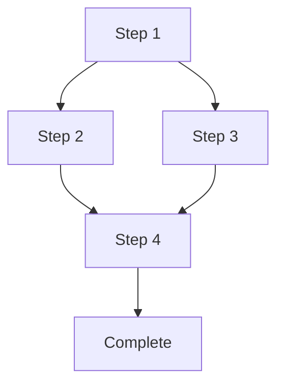

# {Workflow Name}

## Overview

**Goal:** {What this workflow accomplishes}

**Agent:** {primary-agent} (delegates to {sub-agents} for specific operations)

**Chain Enforcement:**
- MUST-BEFORE: {required_prerequisites}
- SHOULD-BEFORE: {recommended_prerequisites}

## Pre-Execution Checkpoint

**State Required:**
```yaml
phase: "{current_phase}"
state.json_exists: true
active_anchors: []
{additional_state_requirements}
```

**Validation:**
```yaml
checks:
  - {check_name}: {pass|fail}
  {artifact_exists}: {path}
  schema_valid: true
```

**Rollback on Failure:** {rollback_procedure}

## Workflow Steps

### Step 1: {Step Title}

**Agent:** {agent-name}
**Action:** {what the step does}
**Input:**
- {input_1}: {description}
- {input_2}: {description}
**Output:**
- {output_1}: {description}
**Checkpoint:** {validation_before_proceeding}

**Chain Rule:** {applicable_chain_rule}

**On Failure:**
- {remediation_action}

### Step 2: {Step Title}

{repeat_structure}

## Step Dependencies



## Integration Points

### Agent Bindings

| Step | Agent | Purpose | Permissions Required |
|------|-------|---------|---------------------|
| 1 | {agent} | {purpose} | {permissions} |
| 2 | {agent} | {purpose} | {permissions} |

### Tool Bindings

| Step | Tool | Purpose | Parameters |
|------|------|---------|------------|
| 1 | {tool} | {purpose} | {params} |

### File I/O

**Reads From:**
- `{path_to_file}` - {purpose}

**Writes To:**
- `{path_to_file}` - {purpose} (create/append)

**Modifies:**
- `{path_to_file}` - {modification_type}

## Post-Execution Checkpoint

**Success Criteria:**
- [ ] All steps completed
- [ ] All outputs created
- [ ] All validations passed
- [ ] No chain rule violations

**State Update:**
```yaml
state:
  phase: {new_phase}
  lastValidation: {timestamp}
  history: + "workflow:{name}:complete"
anchors:
  - type: "checkpoint"
    content: "{workflow} completed successfully"
    priority: "high"
```

## Error Handling

### Failure Modes

| Scenario | Detection | Recovery | User Action Required |
|----------|-----------|----------|---------------------|
| {failure_1} | {how_to_detect} | {auto-recovery} | {yes/no} |

### Rollback Procedure

```yaml
trigger: "{when_to_rollback}"
steps:
  1: "{rollback_step_1}"
  2: "{rollback_step_2}"
restore_point: "{checkpoint_to_restore}"
```

## Validation Criteria

### Schema Validation
```yaml
required_fields_present: true
yaml_syntax_valid: true
enum_values_valid: true
```

### Integration Validation
```yaml
agents_exist: true
tools_available: true
commands_defined: true
```

### Completeness Validation
```yaml
no_gaps: true
no_overlaps: true
exit_conditions_defined: true
```

### Governance Validation
```yaml
hierarchy_respected: true
permissions_match: true
chain_rules_followed: true
```
