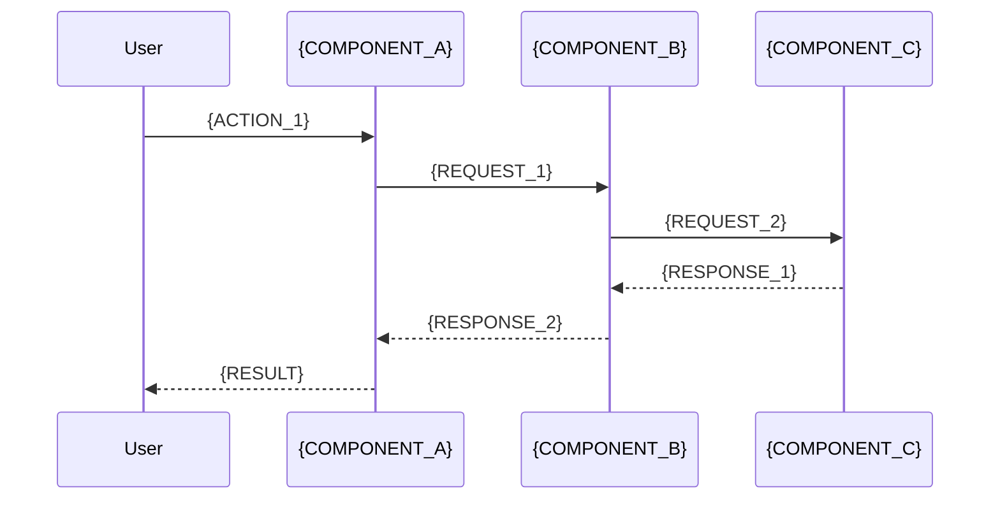

# Specification: {FEATURE_NAME}

## 0. Spec Metadata

### 0.1 Document Lineage
```yaml
lineage:
  idea_brief: "{IDEA_ID}"
  research: "{RESEARCH_ID}"
  previous_versions: []
  derived_from: null | "{PARENT_SPEC_ID}"
```

### 0.2 Validation Status
```yaml
validation:
  internal_consistency: pending | pass | fail
  research_alignment: pending | pass | fail
  clarity_scan: pending | pass | fail
  multi_agent_review: pending | pass | fail
  
validators:
  - agent: "@idumb-skeptic-validator"
    status: pending
    timestamp: null
  - agent: "@idumb-plan-checker"
    status: pending
    timestamp: null
```

### 0.3 Approval Chain
| Approver | Status | Date | Notes |
|----------|--------|------|-------|
| @idumb-planner | pending | - | - |
| User | pending | - | - |

---

## 1. Executive Summary

### 1.1 One-Line Summary
{ONE_LINE_SUMMARY}

### 1.2 Overview
{2-3_PARAGRAPH_OVERVIEW}

### 1.3 Business Value
**Problem solved:** {PROBLEM}
**Value delivered:** {VALUE}
**Success metric:** {METRIC}

---

## 2. Requirements

### 2.1 Functional Requirements

#### FR-001: {REQUIREMENT_TITLE}
```yaml
id: FR-001
title: "{REQUIREMENT_TITLE}"
priority: must-have | should-have | nice-to-have
source: IDEA-BRIEF.scope.{item}
description: |
  {DETAILED_DESCRIPTION}
  
acceptance_criteria:
  - criterion: "{CRITERION_1}"
    verification: "{HOW_TO_TEST}"
  - criterion: "{CRITERION_2}"
    verification: "{HOW_TO_TEST}"
    
dependencies: []
research_backing: "{RESEARCH_SECTION_REF}"
```

#### FR-002: {REQUIREMENT_TITLE}
```yaml
id: FR-002
title: "{REQUIREMENT_TITLE}"
priority: must-have | should-have | nice-to-have
source: IDEA-BRIEF.scope.{item}
description: |
  {DETAILED_DESCRIPTION}
  
acceptance_criteria:
  - criterion: "{CRITERION_1}"
    verification: "{HOW_TO_TEST}"
    
dependencies: [FR-001]
research_backing: "{RESEARCH_SECTION_REF}"
```

### 2.2 Non-Functional Requirements

#### NFR-001: {REQUIREMENT_TITLE}
```yaml
id: NFR-001
category: performance | security | scalability | reliability | accessibility
title: "{REQUIREMENT_TITLE}"
priority: must-have | should-have
description: |
  {DETAILED_DESCRIPTION}
  
metrics:
  - metric: "{METRIC_NAME}"
    target: "{TARGET_VALUE}"
    measurement: "{HOW_TO_MEASURE}"
    
research_backing: "{RESEARCH_SECTION_REF}"
```

#### NFR-002: {REQUIREMENT_TITLE}
```yaml
id: NFR-002
category: performance | security | scalability | reliability | accessibility
title: "{REQUIREMENT_TITLE}"
priority: must-have | should-have
description: |
  {DETAILED_DESCRIPTION}
  
metrics:
  - metric: "{METRIC_NAME}"
    target: "{TARGET_VALUE}"
    measurement: "{HOW_TO_MEASURE}"
```

### 2.3 User Requirements

#### UR-001: {REQUIREMENT_TITLE}
```yaml
id: UR-001
persona: "{USER_PERSONA}"
title: "{REQUIREMENT_TITLE}"
user_story: |
  As a {PERSONA},
  I want to {ACTION},
  So that {BENEFIT}.
  
acceptance_criteria:
  - criterion: "{CRITERION}"
    verification: "{HOW_TO_TEST}"
```

### 2.4 Requirements Traceability Matrix
| Req ID | Source | Research Ref | Architecture | Tests | Status |
|--------|--------|--------------|--------------|-------|--------|
| FR-001 | IDEA-BRIEF.3.1 | RESEARCH.4.1 | Section 4.2 | TC-001 | defined |
| FR-002 | IDEA-BRIEF.3.1 | RESEARCH.4.2 | Section 4.3 | TC-002 | defined |
| NFR-001 | IDEA-BRIEF.2.3 | RESEARCH.3.2 | Section 4.4 | TC-003 | defined |

---

## 3. Technical Approach

### 3.1 Approach Selection
**Selected approach:** {APPROACH_NAME}

**From research options:**
| Option | Effort | Risk | Selected |
|--------|--------|------|----------|
| {OPTION_1} | medium | low | ✓ |
| {OPTION_2} | low | high | |
| {OPTION_3} | high | low | |

**Justification:**
{DETAILED_JUSTIFICATION_WITH_RESEARCH_REFS}

### 3.2 Technology Stack
```yaml
stack:
  language: 
    name: "{LANGUAGE}"
    version: "{VERSION}"
    rationale: "{RATIONALE}"
    research_ref: "RESEARCH.3.1"
    
  framework:
    name: "{FRAMEWORK}"
    version: "{VERSION}"
    rationale: "{RATIONALE}"
    research_ref: "RESEARCH.3.2"
    
  new_dependencies:
    - name: "{PACKAGE}"
      version: "{VERSION}"
      purpose: "{PURPOSE}"
      research_ref: "RESEARCH.4.1"
      
  build_tools:
    - name: "{TOOL}"
      version: "{VERSION}"
      config_file: "{FILE}"
```

### 3.3 Constraints Applied
| Constraint | From | Impact on Spec | Handling |
|------------|------|----------------|----------|
| {CONSTRAINT_1} | IDEA-BRIEF.3.1 | {IMPACT} | {HANDLING} |
| {CONSTRAINT_2} | IDEA-BRIEF.3.2 | {IMPACT} | {HANDLING} |
| {CONSTRAINT_3} | RESEARCH.7.1 | {IMPACT} | {HANDLING} |

---

## 4. Architecture

### 4.1 High-Level Architecture
```mermaid
graph TB
    subgraph "{LAYER_1}"
        A[{COMPONENT_A}]
        B[{COMPONENT_B}]
    end
    
    subgraph "{LAYER_2}"
        C[{COMPONENT_C}]
        D[{COMPONENT_D}]
    end
    
    subgraph "{LAYER_3}"
        E[{COMPONENT_E}]
    end
    
    A --> C
    B --> C
    C --> D
    D --> E
```

### 4.2 Component Specifications

#### Component: {COMPONENT_A}
```yaml
name: "{COMPONENT_NAME}"
type: ui_component | service | utility | api_handler | data_model
responsibility: |
  {SINGLE_RESPONSIBILITY_DESCRIPTION}

inputs:
  - name: "{INPUT_1}"
    type: "{TYPE}"
    required: true | false
    validation: "{VALIDATION_RULES}"
    
outputs:
  - name: "{OUTPUT_1}"
    type: "{TYPE}"
    description: "{DESCRIPTION}"

dependencies:
  internal: ["{COMPONENT_B}"]
  external: ["{PACKAGE}"]
  
state:
  manages: true | false
  state_shape: |
    {STATE_DEFINITION}
    
error_handling:
  - error: "{ERROR_TYPE}"
    handling: "{HANDLING_STRATEGY}"
```

#### Component: {COMPONENT_B}
```yaml
name: "{COMPONENT_NAME}"
type: ui_component | service | utility | api_handler | data_model
responsibility: |
  {SINGLE_RESPONSIBILITY_DESCRIPTION}

inputs:
  - name: "{INPUT_1}"
    type: "{TYPE}"
    
outputs:
  - name: "{OUTPUT_1}"
    type: "{TYPE}"

dependencies:
  internal: []
  external: ["{PACKAGE}"]
```

### 4.3 Data Flow


### 4.4 State Management
```yaml
state_architecture:
  pattern: "{PATTERN_NAME}"  # e.g., Redux, Zustand, Context, None
  rationale: "{RATIONALE}"
  research_ref: "RESEARCH.4.x"
  
global_state:
  - key: "{STATE_KEY}"
    type: "{TYPE}"
    updated_by: ["{COMPONENT}"]
    consumed_by: ["{COMPONENT}"]
    
local_state:
  - component: "{COMPONENT}"
    state: "{STATE_SHAPE}"
```

---

## 5. Interfaces

### 5.1 API Contracts

#### Endpoint: {ENDPOINT_NAME}
```yaml
path: "{PATH}"
method: GET | POST | PUT | DELETE | PATCH
description: "{DESCRIPTION}"

request:
  headers:
    - name: "{HEADER}"
      required: true | false
      type: "{TYPE}"
      
  params:
    - name: "{PARAM}"
      type: "{TYPE}"
      required: true | false
      validation: "{RULES}"
      
  body:
    content_type: "application/json"
    schema: |
      {
        "{FIELD}": "{TYPE}",
        "{FIELD}": "{TYPE}"
      }

response:
  success:
    status: 200 | 201 | 204
    body: |
      {
        "{FIELD}": "{TYPE}"
      }
      
  errors:
    - status: 400
      body: |
        {
          "error": "{ERROR_TYPE}",
          "message": "{MESSAGE}"
        }
    - status: 404
      body: |
        {
          "error": "not_found",
          "message": "{MESSAGE}"
        }
```

### 5.2 Component Interfaces

#### Interface: {INTERFACE_NAME}
```typescript
interface {INTERFACE_NAME} {
  // Properties
  {property}: {type};
  
  // Methods
  {methodName}({params}): {returnType};
}
```

### 5.3 Data Schemas

#### Schema: {SCHEMA_NAME}
```typescript
type {SCHEMA_NAME} = {
  id: string;
  {field}: {type};
  {field}: {type};
  createdAt: Date;
  updatedAt: Date;
};
```

### 5.4 External Integration Contracts
```yaml
integrations:
  - name: "{INTEGRATION_NAME}"
    type: api | webhook | sdk
    documentation: "{DOCS_URL}"
    
    authentication:
      method: "{AUTH_METHOD}"
      credentials: "{ENV_VAR_REF}"
      
    endpoints_used:
      - path: "{PATH}"
        method: "{METHOD}"
        purpose: "{PURPOSE}"
        
    error_handling:
      - scenario: "{SCENARIO}"
        handling: "{STRATEGY}"
        fallback: "{FALLBACK}"
```

---

## 6. Acceptance Criteria

### 6.1 Functional Acceptance

#### AC-001: {CRITERION_TITLE}
```yaml
id: AC-001
requirement_ref: FR-001
type: functional
priority: critical | high | medium

criterion: |
  {DETAILED_CRITERION}
  
given: "{PRECONDITION}"
when: "{ACTION}"
then: "{EXPECTED_RESULT}"

verification:
  method: manual | automated | both
  test_type: unit | integration | e2e
  test_id: "TC-001"
```

#### AC-002: {CRITERION_TITLE}
```yaml
id: AC-002
requirement_ref: FR-002
type: functional
priority: critical | high | medium

criterion: |
  {DETAILED_CRITERION}
  
given: "{PRECONDITION}"
when: "{ACTION}"
then: "{EXPECTED_RESULT}"

verification:
  method: automated
  test_type: integration
  test_id: "TC-002"
```

### 6.2 Non-Functional Acceptance

#### AC-NFR-001: {CRITERION_TITLE}
```yaml
id: AC-NFR-001
requirement_ref: NFR-001
type: performance | security | accessibility

criterion: |
  {DETAILED_CRITERION}
  
measurement:
  metric: "{METRIC}"
  target: "{VALUE}"
  tool: "{MEASUREMENT_TOOL}"
  
verification:
  method: automated
  test_type: performance | security | audit
  test_id: "TC-NFR-001"
```

### 6.3 Edge Cases & Error Scenarios

| Scenario | Input | Expected Behavior | AC Reference |
|----------|-------|-------------------|--------------|
| {EDGE_CASE_1} | {INPUT} | {BEHAVIOR} | AC-001 |
| {ERROR_SCENARIO_1} | {INPUT} | {ERROR_HANDLING} | AC-002 |
| {BOUNDARY_CASE_1} | {INPUT} | {BEHAVIOR} | AC-001 |

### 6.4 Acceptance Matrix
| Criterion ID | Priority | Automated | Manual | Status |
|--------------|----------|-----------|--------|--------|
| AC-001 | critical | ✓ | ✓ | defined |
| AC-002 | high | ✓ | | defined |
| AC-NFR-001 | high | ✓ | | defined |

---

## 7. Risks & Mitigations

### 7.1 Risk Register (From Research)
| ID | Risk | Probability | Impact | Mitigation | Owner | Status |
|----|------|-------------|--------|------------|-------|--------|
| TR1 | {RISK_1} | medium | high | {MITIGATION} | - | open |
| TR2 | {RISK_2} | low | medium | {MITIGATION} | - | open |
| DR1 | {RISK_3} | medium | medium | {MITIGATION} | - | open |

### 7.2 Spec-Specific Risks
| ID | Risk | Probability | Impact | Mitigation | Contingency |
|----|------|-------------|--------|------------|-------------|
| SR1 | {SPEC_RISK_1} | {PROB} | {IMPACT} | {MITIGATION} | {PLAN_B} |
| SR2 | {SPEC_RISK_2} | {PROB} | {IMPACT} | {MITIGATION} | {PLAN_B} |

### 7.3 Risk Impact on Architecture
| Risk | Affected Components | Design Decision |
|------|---------------------|-----------------|
| TR1 | {COMPONENT} | {DECISION_MADE} |
| DR1 | {COMPONENT} | {DECISION_MADE} |

---

## 8. Spec Validation

### 8.1 Internal Consistency Check
```yaml
consistency_check:
  requirements_to_architecture:
    - requirement: FR-001
      architecture_section: 4.2.{COMPONENT}
      status: aligned | gap | conflict
      
  architecture_to_interfaces:
    - component: {COMPONENT}
      interface_section: 5.x
      status: aligned | gap | conflict
      
  acceptance_coverage:
    - requirement: FR-001
      acceptance_criteria: [AC-001, AC-002]
      coverage: complete | partial | missing

overall_status: pass | warn | fail
gaps_found: []
conflicts_found: []
```

### 8.2 Research Alignment Check
```yaml
research_alignment:
  tech_decisions:
    - decision: "{DECISION}"
      research_backing: "RESEARCH.{SECTION}"
      alignment: aligned | diverged | unsupported
      
  approach_selection:
    selected: "{APPROACH}"
    research_recommended: "{APPROACH}"
    alignment: aligned | diverged
    divergence_justification: "{IF_DIVERGED}"
    
  risk_coverage:
    research_risks_addressed: [TR1, DR1]
    research_risks_missing: []

overall_alignment_score: {0-100}
threshold: 90
status: pass | fail
```

### 8.3 Under-Clarification Scan
```yaml
clarity_scan:
  blockers:
    - pattern: "TBD"
      found: false
      locations: []
    - pattern: "TODO"
      found: false
      locations: []
    - pattern: "?"
      found: false
      locations: []
      
  vague_language:
    - pattern: "maybe|might|possibly"
      found: false
      locations: []
    - pattern: "should work|probably"
      found: false
      locations: []
      
  missing_sections: []
  
  citation_check:
    claims_without_backing: []
    
overall_clarity: pass | warn | fail
blockers_count: 0
warnings_count: 0
```

### 8.4 Multi-Agent Validation Results
```yaml
validation_results:
  skeptic_validator:
    agent: "@idumb-skeptic-validator"
    timestamp: "{TIMESTAMP}"
    result: pass | warn | fail
    challenges:
      - challenge: "{CHALLENGE_1}"
        resolution: "{RESOLUTION}"
      - challenge: "{CHALLENGE_2}"
        resolution: "{RESOLUTION}"
        
  plan_checker:
    agent: "@idumb-plan-checker"
    timestamp: "{TIMESTAMP}"
    result: pass | warn | fail
    feasibility_score: {0-100}
    notes: "{NOTES}"
    
  integration_checker:
    agent: "@idumb-integration-checker"
    timestamp: "{TIMESTAMP}"
    result: pass | warn | fail
    integration_issues: []
```

---

## 9. Approval

### 9.1 Spec Summary for Approval
**Feature:** {FEATURE_NAME}
**Complexity:** {COMPLEXITY}
**Estimated effort:** {EFFORT}

**Key decisions:**
1. {DECISION_1}
2. {DECISION_2}
3. {DECISION_3}

**Risks accepted:**
1. {RISK_1} - Mitigation: {MITIGATION}

**Requirements count:** {FR_COUNT} functional, {NFR_COUNT} non-functional
**Acceptance criteria count:** {AC_COUNT}

### 9.2 Approval Gate
```yaml
approval:
  requested: "{TIMESTAMP}"
  status: pending | approved | rejected | changes_requested
  
  approver_response:
    decision: approve | reject | request_changes
    timestamp: null
    notes: ""
    
  if_rejected:
    reason: ""
    route_to_stage: ""
    
  if_changes_requested:
    changes:
      - section: ""
        change: ""
    route_to_stage: "3.x"
    
  if_approved:
    locked_version: "1.0.0"
    locked_timestamp: ""
    proceed_to: "4.1"
```

---

## 10. Version History

| Version | Date | Changes | Author |
|---------|------|---------|--------|
| 0.1.0-draft | {DATE} | Initial creation | {AGENT} |

---

## Appendices

### A. Glossary
| Term | Definition |
|------|------------|
| {TERM_1} | {DEFINITION} |
| {TERM_2} | {DEFINITION} |

### B. Related Documents
- IDEA-BRIEF: `{PATH}`
- RESEARCH: `{PATH}`
- Previous specs: `{PATH}`

### C. Open Questions (For Discussion)
- [ ] {QUESTION_1}
- [ ] {QUESTION_2}

---

*Template: SPEC v1.0.0*
*Stage: 3 - Specification*
*Output of: 3.10 Spec Synthesis & Versioning*
