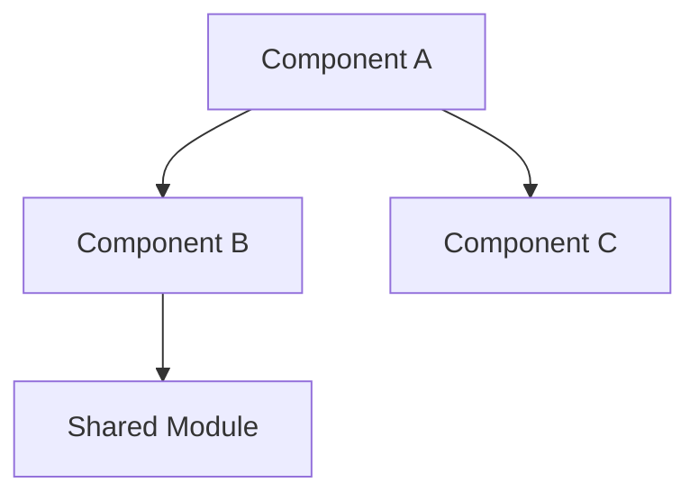

# Codebase Architecture Template

## Purpose

Documents the architectural patterns, layer organization, component relationships, and data flow within the codebase. This template captures both the intended architecture (from documentation) and the actual architecture (from code analysis).

## When to Use

- During `/idumb:map-codebase` workflow (after stack detection)
- When analyzing how components interact
- Before making changes that span multiple layers
- When onboarding developers who need to understand code organization
- During architecture reviews or refactoring planning

## Structure

```markdown
# Architecture Overview

> Generated: {iso_timestamp}
> Detected by: idumb-codebase-mapper
> Pattern Confidence: {high|medium|low}

## Architecture Pattern

**Primary Pattern:** {pattern_name}
**Variant:** {specific_variant_if_applicable}

### Pattern Description
{Brief description of the pattern and why it was identified}

### Pattern Evidence
```
{Code or structure that demonstrates the pattern}
```

## Layer Organization

| Layer | Purpose | Location | Depends On |
|-------|---------|----------|------------|
| {layer} | {purpose} | {path/glob} | {other_layers} |

### Layer Boundaries

```
┌─────────────────────────────────┐
│ Presentation Layer              │
│ (UI, Views, Controllers)        │
├─────────────────────────────────┤
│ Application Layer               │
│ (Use Cases, Services)           │
├─────────────────────────────────┤
│ Domain Layer                    │
│ (Entities, Business Logic)      │
├─────────────────────────────────┤
│ Infrastructure Layer            │
│ (Database, External APIs)       │
└─────────────────────────────────┘
```

### Layer Rules
- {Rule about layer dependencies}
- {Rule about communication direction}

## Components

### Core Components

| Component | Type | Location | Responsibility |
|-----------|------|----------|----------------|
| {name} | {type} | {path} | {what_it_does} |

### Component Dependencies



### Component Interfaces
- **{Component}**: Exposes {interface_type}
- **{Component}**: Consumes {interface_type}

## Data Flow

### Primary Data Flows

```
1. {Flow Name}
   Request → Controller → Service → Repository → Database
                                                    ↓
   Response ← Controller ← Service ← Repository ← Result
```

### State Management
- **Pattern:** {Redux/Zustand/Context/MobX/etc.}
- **Store Location:** {path}
- **State Shape:** {brief_description}

### Event Flow
- **Event System:** {type_if_any}
- **Message Queue:** {queue_if_any}

## API Structure

### Internal APIs
| API | Type | Location | Consumer |
|-----|------|----------|----------|
| {api} | {REST/GraphQL/RPC} | {path} | {who_uses_it} |

### External API Calls
| External API | Purpose | Wrapper Location |
|--------------|---------|------------------|
| {api_name} | {purpose} | {client_path} |

## Design Patterns Used

| Pattern | Usage | Example Location |
|---------|-------|------------------|
| {pattern} | {where_used} | {path:line} |

### Pattern Evidence
```{language}
// Example of pattern in use
{code_example}
```

## Architecture Decisions

| Decision | Rationale | Date | Status |
|----------|-----------|------|--------|
| {decision} | {why} | {when} | {active/deprecated} |

## Constraints

- {Architectural constraint 1}
- {Architectural constraint 2}

## Detection Evidence

```bash
# How architecture was detected
{commands and outputs}
```

### Files Analyzed
- `{file}` - {what was inferred}
```

## Fields

| Field | Required | Description | Detection Method |
|-------|----------|-------------|------------------|
| pattern | Yes | Architecture pattern (MVC, Clean, Hexagonal, etc.) | Directory structure, imports |
| layers | Yes | Organizational layers with purposes | Directory names, module boundaries |
| components | Yes | Key components with responsibilities | Module analysis, class detection |
| data_flow | Yes | How data moves through system | Import analysis, type definitions |
| api_structure | No | Internal and external APIs | Route files, service clients |
| patterns_used | No | Design patterns detected | Code analysis |
| constraints | No | Architecture constraints/rules | Documentation, conventions |

## Common Architecture Patterns

| Pattern | Indicators |
|---------|------------|
| MVC | controllers/, models/, views/ directories |
| Clean Architecture | domain/, infrastructure/, application/ |
| Hexagonal/Ports-Adapters | ports/, adapters/ directories |
| Layered | layers with clear dependency direction |
| Microservices | services/ with isolated concerns |
| Monolith | Single deployment, shared database access |
| Event-Driven | event handlers, message queues |
| CQRS | Separate read/write models |

## Example

```markdown
# Architecture Overview

> Generated: 2026-02-03T11:00:00.000Z
> Pattern Confidence: high

## Architecture Pattern

**Primary Pattern:** Clean Architecture
**Variant:** Feature-sliced with domain modules

### Pattern Evidence
```
src/
├── features/           # Feature slices (vertical)
│   ├── auth/
│   │   ├── domain/     # Business logic
│   │   ├── data/       # Data access
│   │   └── ui/         # Presentation
│   └── users/
│       ├── domain/
│       ├── data/
│       └── ui/
└── shared/             # Shared infrastructure
```

## Layer Organization

| Layer | Purpose | Location | Depends On |
|-------|---------|----------|------------|
| UI | React components | */ui/ | Domain |
| Domain | Business logic | */domain/ | None |
| Data | Data access | */data/ | Domain |
| Shared | Cross-cutting | /shared/ | None |

## Components

| Component | Type | Location | Responsibility |
|-----------|------|----------|----------------|
| AuthService | Service | features/auth/domain | Authentication logic |
| UserRepository | Repository | features/users/data | User data access |
| LoginForm | Component | features/auth/ui | Login UI |
```

## Validation Checklist

- [ ] Primary architecture pattern identified
- [ ] At least 2 layers documented with purposes
- [ ] At least 3 core components listed
- [ ] Data flow documented (at least one flow)
- [ ] Layer dependencies specified
- [ ] Pattern evidence provided
- [ ] Detection commands documented
- [ ] Component locations are valid paths

## Related Templates

- [stack.md](./stack.md) - Technology that enables architecture
- [structure.md](./structure.md) - Directory structure details
- [concerns.md](./concerns.md) - Cross-cutting concerns
- [integrations.md](./integrations.md) - External system integration

---
*Template: codebase-architecture v0.1.0*
